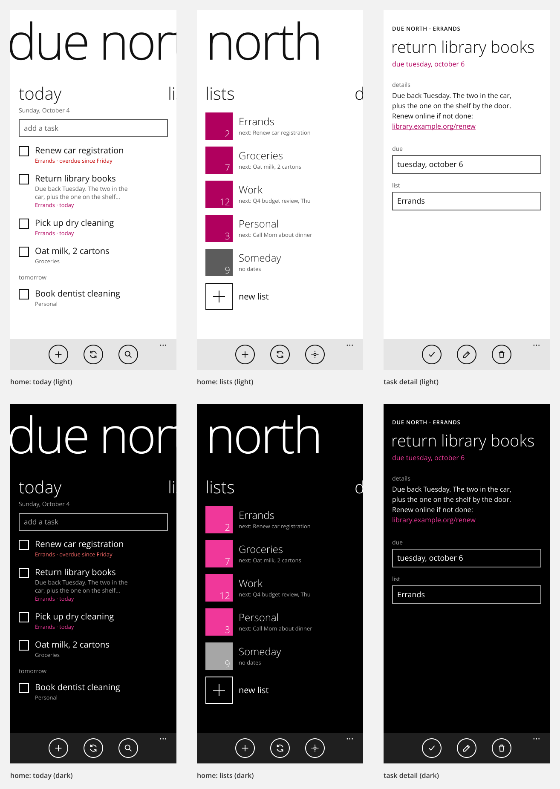
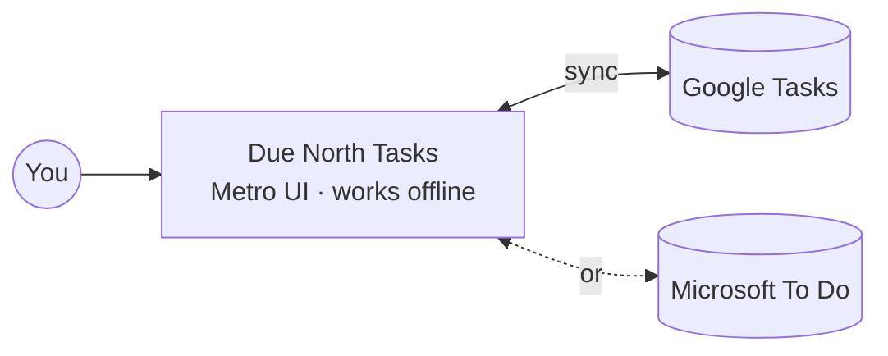

# Due North Tasks

A Windows Phone 8.1 **Metro**-style todo app for Android that syncs with **Google Tasks or
Microsoft To Do**, one at a time.

## Status

Planning. The app is specified with [GitHub Spec Kit](https://github.com/github/spec-kit):

| Read this | For |
|---|---|
| [constitution](.specify/memory/constitution.md) | The non-negotiables: Metro design rules, one provider at a time, offline first |
| [spec](specs/001-metro-todo-app/spec.md) | What the app does, as user stories with acceptance tests |
| [plan](specs/001-metro-todo-app/plan.md) | Architecture, sync flow, modules and milestone roadmap (diagrams) |
| [research](specs/001-metro-todo-app/research.md) | Decisions: fonts, Metro components, Google/Microsoft API facts |
| [data model](specs/001-metro-todo-app/data-model.md) | Local database, task states, provider field mapping |
| [contracts](specs/001-metro-todo-app/contracts/) | The `TaskProvider` seam and the screen map |
| [tasks](specs/001-metro-todo-app/tasks.md) | 58 ordered build tasks, grouped by milestone |

## Building it with Spec Kit

The Spec Kit skills are installed for Claude Code in `.claude/skills/`. The next step is
`/speckit-implement`, which works through `tasks.md` phase by phase. Change the plan first with
`/speckit-clarify` (spec questions) or by editing the files above.
