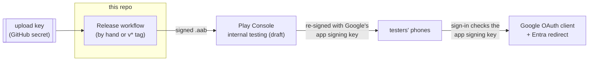

# Releasing Due North Tasks

How a signed build gets from this repo to a phone, and the one-time setup outside the repo
(tasks T067 and T068). Nothing here is automatic: the release workflow runs only when started
by hand or by a `v*` tag, and it sends Play a **draft** that a person rolls out.



## Two keys, and why sign-in cares

Play App Signing means two keys are involved:

| Key | Who holds it | Signs | Register its fingerprints? |
|---|---|---|---|
| **Upload key** (`due-north-release.keystore`) | You (project files + GitHub secret) | The bundle you upload, and any release APK you sideload | Yes, if you ever sideload a release build |
| **App signing key** | Google (made when you create the first release) | Every install from Play | **Yes**: Play Console > Test and release > App integrity shows its SHA-1 and SHA-256 |
| Debug key (`due-north-debug.keystore`) | Project files | Debug and "optimized" (benchmark) builds | Already registered |

Google sign-in checks the SHA-1 of the key that signed the installed app, and Microsoft sign-in
checks a base64 hash of it. So each key that signs something people install needs:

1. **Google Cloud**: an extra Android OAuth client (APIs & Services > Credentials > Create
   credentials > OAuth client ID > Android), package `app.duenorth.tasks`, that key's SHA-1. The
   web client ID in the app stays the same.
2. **Entra**: an extra Android redirect (app registration > Authentication > Android > Add
   URI): package `app.duenorth.tasks`, that key's signature hash.

To turn Play's SHA-1 into the Microsoft hash:

```bash
echo <SHA-1 with the colons removed> | xxd -r -p | openssl base64
```

Release builds use `msal.releaseSignatureHash` (CI: `MSAL_RELEASESIGNATUREHASH`) for the
Microsoft redirect; set it to the **app signing key's** hash for Play builds, or the upload
key's hash for a sideloaded release APK. Debug and benchmark builds keep using
`msal.signatureHash`.

## Signing settings

Read from `local.properties` or the matching environment variable (dots become underscores,
upper case). Without a keystore, release builds fall back to the debug key so local builds and
benchmarks still work.

| local.properties | Environment / GitHub secret | Value |
|---|---|---|
| `release.storeFile` | `RELEASE_STOREFILE` (CI writes it from `RELEASE_KEYSTORE_BASE64`) | path to the upload keystore |
| `release.storePassword` | `RELEASE_STOREPASSWORD` | from `due-north-release.properties` |
| `release.keyAlias` | `RELEASE_KEYALIAS` | `duenorth-release` |
| `release.keyPassword` | `RELEASE_KEYPASSWORD` | from `due-north-release.properties` |
| `msal.releaseSignatureHash` | `MSAL_RELEASESIGNATUREHASH` | see above |
| `app.versionCode` | `APP_VERSIONCODE` (CI sets 1000 + run number) | must grow with every Play upload |
| | `PLAY_SERVICE_ACCOUNT_JSON` (optional) | Play service account key; without it the workflow only attaches the bundle to the run |

`RELEASE_KEYSTORE_BASE64` is the keystore file base64-encoded (`base64 -w0 due-north-release.keystore`).
Keep an offline copy of the keystore and its passwords; the keystore must never be committed.

## Play Console internal testing (T068)

1. Create a Play developer account (one-time fee) and the app: name "Due North Tasks", app,
   free.
2. Fill in the required app content: privacy policy URL (below), app access ("sign-in required";
   give review instructions saying any Google or Microsoft account works), ads (none), content
   rating questionnaire, target audience (13+), data safety (answers below).
3. Testing > Internal testing > create a release. The **first** bundle has to be uploaded by
   hand: run the Release workflow, download `release-bundle` from the run, and upload
   `app-release.aab`. Accept Play App Signing when asked.
4. Copy the app signing key's SHA-1 from App integrity and register it with Google and Microsoft
   as above; set `MSAL_RELEASESIGNATUREHASH` to its hash and run the workflow again.
5. Optional, for hands-off uploads after that: Play Console > Users and permissions > invite a
   Google Cloud service account with "Release to testing tracks", and save its JSON key as
   `PLAY_SERVICE_ACCOUNT_JSON`. Each workflow run then lands as a draft on internal testing.
6. Add testers (email list) and share the opt-in link.

### What you do in Play Console

| Step | Where | Notes |
|---|---|---|
| Developer account | play.google.com/console | One-time US$25 fee and identity check. New personal accounts must run a closed test with 12 testers for 14 days before production; internal testing has no such wait |
| Create the app | Home > Create app | Name "Due North Tasks", app, free, package `app.duenorth.tasks` (fixed by the first upload) |
| Store listing | Grow users > Store listing | Short description (80 chars), full description, 512 × 512 icon (`/mnt/project-files/logos/`, from the logo thread), 1024 × 500 feature graphic, at least 2 phone screenshots |
| Privacy policy URL | App content > Privacy policy | Where you host [privacy-policy.md](privacy-policy.md) |
| App access | App content > App access | "All or some functionality is restricted"; reviewers can use any Google or Microsoft account |
| Ads | App content > Ads | No ads |
| Content rating | App content > Content rating | Utility / productivity questionnaire; no violence, no user-to-user content |
| Target audience | App content > Target audience | 13 and over |
| Data safety | App content > Data safety | Answers below |
| Internal testing | Test and release > Testing > Internal testing | Create the release, upload the first bundle, add testers by email, share the opt-in link |
| App signing | Test and release > App integrity | Copy the app signing key's SHA-1 for Google and Entra |

### Data safety answers

| Question | Answer |
|---|---|
| Does the app collect or share user data? | Collects: yes. Shares: no |
| Data types | Personal info > name, email address (app functionality); App activity > other user-generated content: tasks (app functionality) |
| Is data processed ephemerally? | No (kept on the device to work offline) |
| Is collection required? | Yes, sign-in is required to use the app |
| Encrypted in transit? | Yes (HTTPS only) |
| Can users request deletion? | Yes: sign out deletes everything on the phone; tasks are deleted in Google Tasks or Microsoft To Do |

"Collected" here only means the app handles it on the phone and sends it to the user's own
Google or Microsoft account; nothing reaches the developer.

## Privacy policy and Google verification (T067)

The policy is [privacy-policy.md](privacy-policy.md). It has to be reachable at a public URL
on a domain you own (Google checks the domain in Search Console), and the same domain hosts a
small home page that says what the app does and links the policy.

The Google Tasks scope (`.../auth/tasks`) is **sensitive**. While the OAuth consent screen is in
**testing** mode, up to 100 listed test users can sign in with no review, which covers internal
testing. Going public needs verification:

1. Google Auth Platform > Branding: app name, support email, logo (the launcher icon, 120 px),
   home page URL, privacy policy URL, authorized domain.
2. Data Access: only `https://www.googleapis.com/auth/tasks` (plus the default `openid`,
   `email`, `profile`).
3. Audience: publish the app (In production), then submit for verification with:
   - **Scope justification**: "Due North Tasks is a to-do app that shows the user's Google Tasks
     lists in a Windows Phone style interface. It reads tasks to display them and writes the
     changes the user makes (adding, editing, completing, deleting and reordering tasks and
     lists). No narrower scope allows writing tasks; `tasks.readonly` cannot save edits."
   - **Demo video** (unlisted YouTube link) showing: the consent screen with the app name and
     the `tasks` scope, sign-in, the user's lists appearing, then adding and completing a task
     and the change appearing at tasks.google.com.
4. Answer Google's follow-up emails; sensitive (not restricted) scopes need no security
   assessment.

Microsoft needs no review for `Tasks.ReadWrite`. Optional: Entra publisher verification removes
the "unverified" label some work accounts show on the consent screen.
