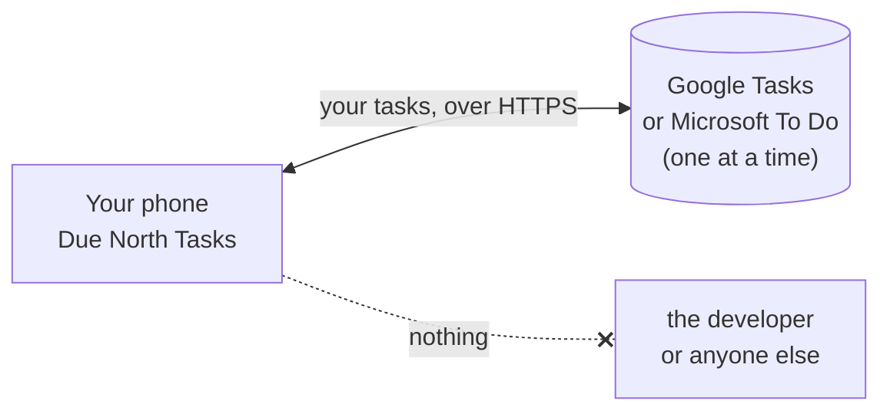

# Due North Tasks privacy policy

_Last updated: 5 October 2026_

Due North Tasks is a to-do app for Android that shows and edits the tasks you already keep in
**Google Tasks** or **Microsoft To Do**. This policy explains what the app touches and where it
goes. The short version: your tasks travel only between your phone and the one service you
connect. We run no servers, and nothing is sent to us.

## What the app accesses

| Data | Why | Where it goes |
|---|---|---|
| Your task lists and tasks (titles, details, due dates, completed state, importance, steps) | To show them and sync your changes | Stored on your phone; sent only to the service you connected |
| Your account name and email address | To show which account is signed in | Stored on your phone only |
| Sign-in tokens | To sync without asking you to sign in every time | Kept by Google Play services or the Microsoft Authentication Library in Android's protected storage |
| Display settings (light or dark, accent color, list shades, sync interval) | To remember your choices | Stored on your phone only; never sent anywhere |
| Sync log (changes that lost a conflict, sync errors) | So you can see what happened to an edit | Stored on your phone only |

The app asks for exactly one permission on each service, the one needed to read and write
tasks:

- Google: `https://www.googleapis.com/auth/tasks`
- Microsoft: `Tasks.ReadWrite`

It does not read your email, calendar, contacts, files or anything else in your account.

## What the app does not do

- It has no analytics, advertising, tracking or crash-reporting libraries.
- It does not sell, share or transfer your data to anyone.
- It does not use your data to train AI or machine-learning models.
- It does not include task data in Android backups.

## Google user data

Due North Tasks' use and transfer of information received from Google APIs adheres to the
[Google API Services User Data Policy](https://developers.google.com/terms/api-services-user-data-policy),
including the Limited Use requirements. Data from Google Tasks is used only to show your tasks
in the app and to sync the changes you make back to Google Tasks.

## Deleting your data

- **Sign out** (settings > sync account) deletes every task, list and sync log entry from your
  phone. Switching to the other service does the same before it connects.
- Uninstalling the app deletes everything it stored on your phone.
- To remove the app's access to your account, use
  [Google account permissions](https://myaccount.google.com/permissions) or
  [Microsoft account app permissions](https://account.live.com/consent/Manage).
- Your tasks themselves stay in Google Tasks or Microsoft To Do, where you can manage or delete
  them as usual.

## Children

The app is not directed at children under 13.

## Changes

If this policy changes, the new version will be posted at this address with a new date above.

## Contact

Questions about this policy: open an issue on the project's page, or email the address listed
on the app's Google Play store page.
