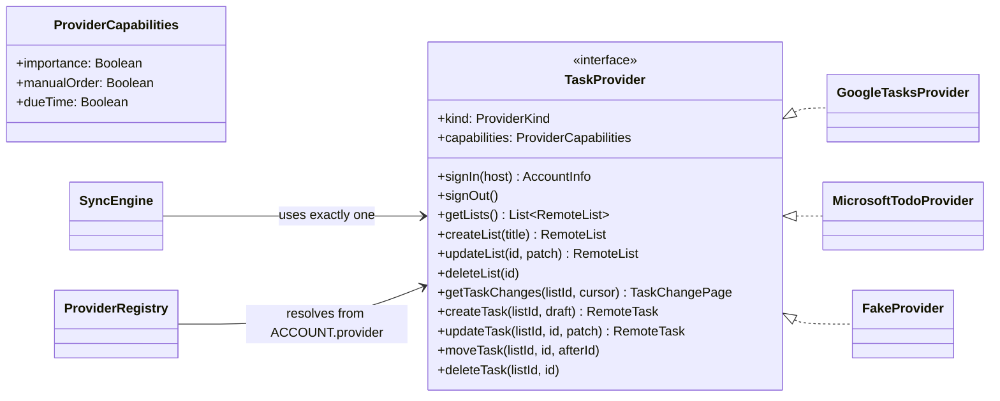

# Contract: `TaskProvider`

The only seam between the app and a remote service (constitution Principle III). Lives in
`provider:api`. Implemented by `provider:google`, `provider:microsoft` and `provider:fake`. Nothing
outside the `provider:*` modules imports Google or Microsoft types.



## Kotlin shape

```kotlin
enum class ProviderKind { GOOGLE, MICROSOFT, FAKE }

data class ProviderCapabilities(
    val importance: Boolean,   // GOOGLE=false, MICROSOFT=true
    val manualOrder: Boolean,  // GOOGLE=true,  MICROSOFT=false
    val dueTime: Boolean,      // false for both in v1 (date-only UI)
)

interface TaskProvider {
    val kind: ProviderKind
    val capabilities: ProviderCapabilities

    suspend fun signIn(host: SignInHost): AccountInfo  // SignInHost wraps the Activity; keeps provider:api JVM-only
    suspend fun signOut()

    suspend fun getLists(): List<RemoteList>
    suspend fun createList(title: String): RemoteList
    suspend fun updateList(id: String, patch: ListPatch): RemoteList
    suspend fun deleteList(id: String)

    /** Pages of changes since [cursor]; null cursor means full fetch. */
    suspend fun getTaskChanges(listId: String, cursor: String?): TaskChangePage
    suspend fun createTask(listId: String, draft: TaskDraft): RemoteTask
    suspend fun updateTask(listId: String, id: String, patch: TaskPatch): RemoteTask
    suspend fun moveTask(listId: String, id: String, afterId: String?)
    suspend fun deleteTask(listId: String, id: String)
}

/** Every field is optional; only non-null fields are sent (PATCH semantics, FR-024). */
data class TaskPatch(
    val title: String? = null,
    val notes: String? = null,
    val dueDate: Patch<LocalDate>? = null,   // Patch.Set(value) or Patch.Clear
    val completed: Boolean? = null,
    val important: Boolean? = null,
    val steps: List<StepPatch>? = null,
)

data class TaskChangePage(
    val changed: List<RemoteTask>,
    val deletedIds: List<String>,
    val nextCursor: String,
    val hasMore: Boolean,
)
```

## Errors

All implementations map failures to one sealed type so the sync engine never sees HTTP or SDK
exceptions:

| `ProviderError` | Google cause | Microsoft cause | Sync engine reaction |
|---|---|---|---|
| `AuthRequired` | 401, `UserRecoverableAuthException` | 401, `MsalUiRequiredException` | stop, set `NEEDS_SIGN_IN` |
| `NotFound` | 404 | 404 | drop op, or recover tasks (edge case) |
| `Conflict` | 412 (etag) | 409 / 412 | re-pull entity, apply conflict rule |
| `RateLimited(retryAfter)` | 429, 403 `rateLimitExceeded` | 429 + `Retry-After` | back off |
| `CursorExpired` | 410 on `updatedMin` too old | 410 `syncStateNotFound` | full re-fetch of that list |
| `Transient` | 5xx, IO | 5xx, IO | WorkManager retry with backoff |

## Contract test suite

`provider:api/src/testFixtures/TaskProviderContractTest.kt` is abstract; each provider module
subclasses it (Google and Microsoft against MockWebServer fixtures, Fake directly). Cases:
create/read/update/delete list and task; PATCH leaves unknown fields untouched; steps round-trip;
incremental changes return only edits after cursor; deleted items appear in `deletedIds`;
each `ProviderError` mapping above.
