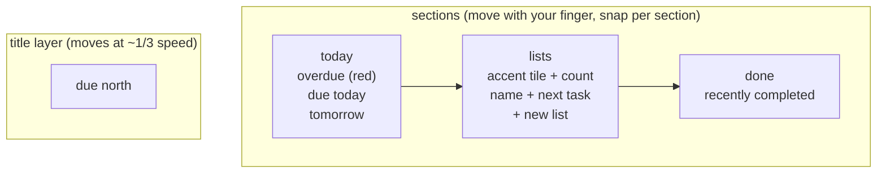
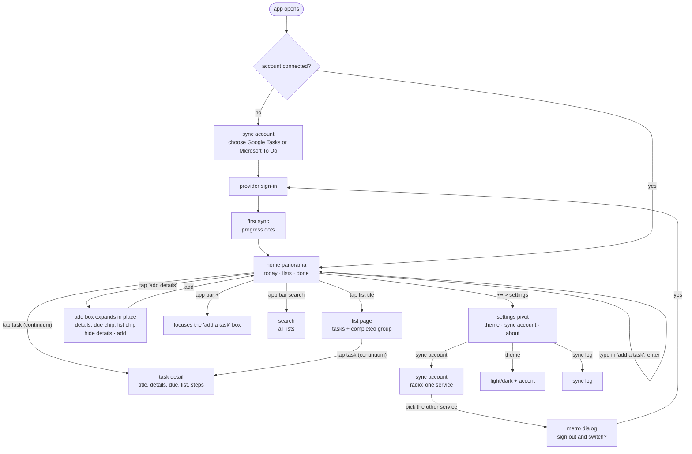

# Contract: Screens and navigation

The user-facing contract for the chosen **Light Panorama** design. Mockups:
[`docs/design/metro-mockups.svg`](../../../docs/design/metro-mockups.svg) and the
[design canvas](https://claude.ai/artifact/UchFxrZaZuaB9Aq82iuQDE) (rows C and C dark).

## The home panorama

One wide surface you swipe across. The title layer moves slower than the sections, and the
next section always peeks in from the right.



## Screen flow



## Screen contracts

| Screen | Layout | App bar buttons (labels on `•••`) | Overflow menu |
|---|---|---|---|
| Home panorama, "today" | "due north" title; "today" header, date caption, "add a task" box (with "add details" link once typing); task rows (square checkbox, 20sp title, up to two grey 14sp lines of details, 13sp caption "List · when", red if overdue); "tomorrow" group | new task, sync, search | settings, sync log |
| Home panorama, "lists" | One row per list: 64dp tile in the list's shade of the app accent (the accent itself by default) with count, 24sp name, "next: ..." caption; "new list" row with outlined + tile. Long-press a tile: rename, list shade, delete | new list, sync, settings | rename/reorder lists |
| Home panorama, "done" | Completed tasks, newest first, struck through, with "undo" on tap | sync, search | clear done |
| List page | "DUE NORTH" small caps, list name as 52sp header, open tasks with due captions in the list's shade, collapsible "completed" group | new task, sync, sort | rename list, list shade, delete list |
| List shade | Header "list shade", a row of seven flat swatches from lightest to darkest shade of the app accent (middle one = the accent, default), with a live preview of the list's tile and a task caption | none | none |
| Task detail | "DUE NORTH · LIST" small caps, title 38sp Light, "due <date>" in accent, "details" label with full text (links tappable), steps if any, then due and list pickers, important (To Do only) | mark done, edit, delete | move to list |
| Search | Header "search", text field focused, results grouped by list | none | none |
| Sync account | "DUE NORTH" small caps, "sync account" header, one-line explanation, radio group (Google Tasks / Microsoft To Do, with "signed in as ..." or "not connected"), switching note, "sync every" picker, "sync on Wi-Fi only" toggle | sync now, sign out | none |
| Settings | Pivot: "theme", "sync account", "about" | none | none |
| Sync log | Header "sync log", rows by time | clear | none |

## Adding a task

```text
type + enter            tap "add details"           back on today             tap the task
┌──────────────────┐    ┌──────────────────────┐    ┌──────────────────┐    ┌──────────────────┐
│[Return library… ]│    │┌────────────────────┐│    │□ Return library  │    │DUE NORTH·ERRANDS │
│ ≡+ add details   │ →  ││Return library…     ││ →  │  Due back Tuesday│ →  │return library    │
│     enter adds it│    ││────────────────────││    │  The two in the… │    │due tuesday       │
│□ Pick up dry…    │    ││details, steps, …   ││    │  Errands · today │    │details           │
└──────────────────┘    │└[today]─[Errands]───┘│    │□ Pick up dry…    │    │full text, links  │
                        │ ⌃ hide details  [add]│    └──────────────────┘    └──────────────────┘
                        └──────────────────────┘
```

The hint under the expanded box names the connected service: "Details sync as the task's notes in
Google Tasks" (or Microsoft To Do).

## Interaction rules

- Back from any secondary page uses the turnstile-out transition and returns to the panorama
  section you left.
- Picking the other service on the sync account page opens a Metro dialog: "Switching signs out of
  Google Tasks. Your tasks stay in that account and come back when you switch again." It warns
  first if there are unsynced changes.
- Long-press on a task opens a Metro context menu (the item scales down slightly, menu drops
  below it): "edit", "delete", "move to".
- Pull down on a section or list triggers sync and shows progress dots across the top edge.
- The status bar matches the theme background; system bars are edge-to-edge.
