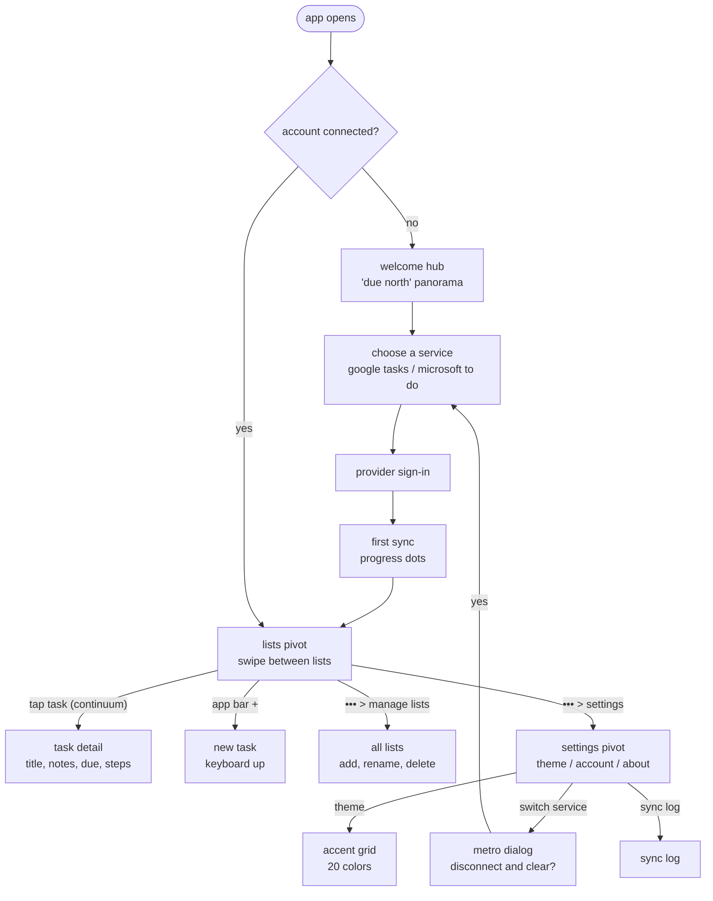

# Contract: Screens and navigation

The user-facing contract. Mockups: [`docs/design/metro-mockups.svg`](../../../docs/design/metro-mockups.svg).

## Screen contracts

| Screen | Layout | App bar buttons (labels on `•••`) | Overflow menu |
|---|---|---|---|
| Welcome hub | Panorama, giant "due north" title, background parallax | none | none |
| Choose a service | Two large text rows, one per service, with a one-line description | none | none |
| Lists pivot | Page title "DUE NORTH TASKS", pivot headers = list names, task rows (checkbox, title, due caption, accent dot if important) | add, sync, sort | manage lists, show/hide completed, settings |
| Task detail | Header = list name (small caps), title in `header` style, then notes, due, steps, important (To Do only) | save, delete, complete | move to list |
| All lists | Header "lists", one row per list with task count | add | none |
| Settings | Pivot: "theme", "account", "about" | none | none |
| Sync log | Header "sync log", rows by time | clear | none |

## Interaction rules

- Back from any secondary page uses the turnstile-out transition.
- Long-press on a task opens a Metro context menu (the item scales down slightly, menu drops
  below it): "edit", "delete", "move to".
- Pull down on a list triggers sync and shows progress dots across the top edge.
- The status bar is tinted with the theme background; system bars are edge-to-edge.
