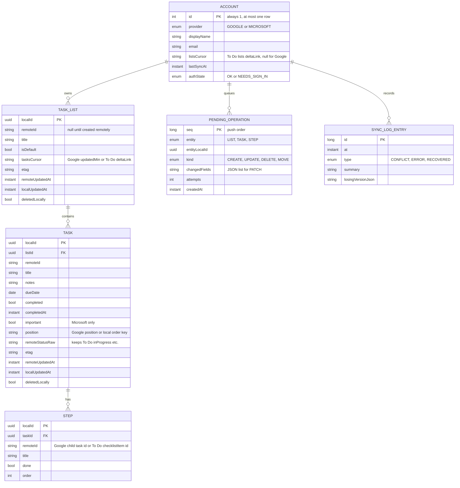
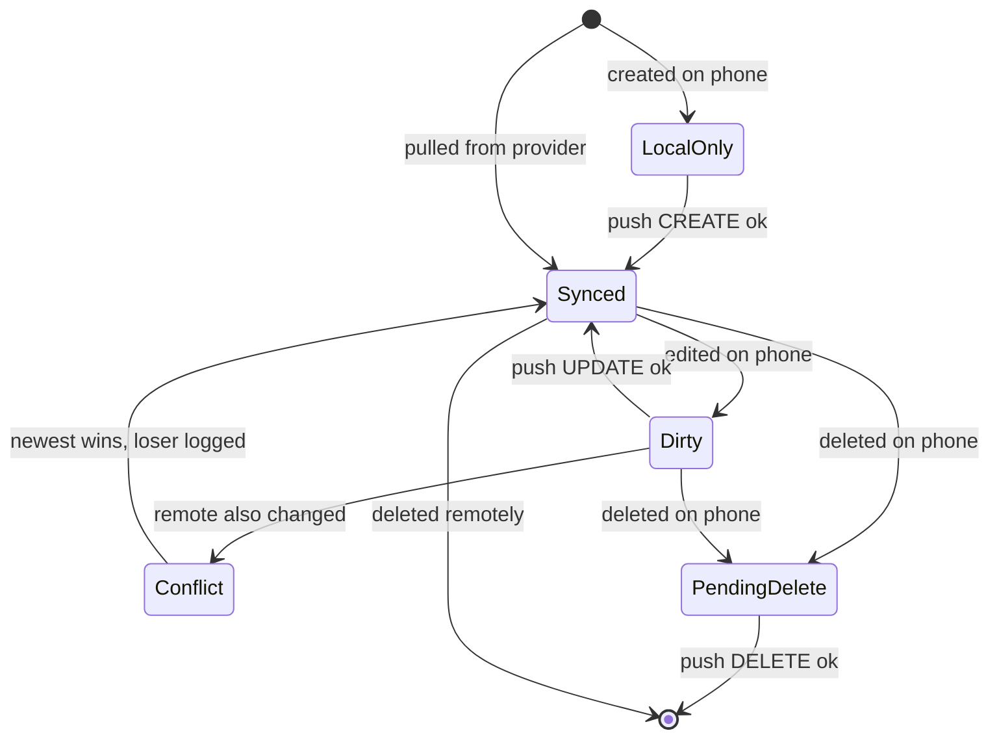

# Data Model: Due North Tasks v1

Phase 1 output for [plan.md](plan.md). Local Room schema in `core:data`.

## Rules

- **One account**: `ACCOUNT.id` is fixed to 1, so a second provider cannot be stored. Switching
  provider deletes the row, which cascades to every other table (constitution Principle III).
- **Validation**: list title 1-256 chars; task title 1-1024 chars (Google's limit is the
  tighter one); notes up to 8,192 chars; steps up to 100 per task.
- **Soft delete**: a local delete sets `deletedLocally` and enqueues `DELETE`; the row is removed
  once the provider confirms.
- **Outbox coalescing**: a new `UPDATE` for an entity that already has a queued `UPDATE` merges
  `changedFields` instead of adding a row; `CREATE` followed by `DELETE` before push cancels both.

## Task state

## Provider field mapping

| Local | Google Tasks | Microsoft To Do |
|---|---|---|
| TaskList.title | `tasklist.title` | `todoTaskList.displayName` |
| TaskList.isDefault | first list (`@default`) | `wellknownListName == defaultList` |
| Task.title | `task.title` | `todoTask.title` |
| Task.notes (shown as "details") | `task.notes` | `todoTask.body.content` (`contentType=text`) |
| Task.dueDate | `task.due` (date part) | `todoTask.dueDateTime` (midnight, device zone) |
| Task.completed | `status == completed` | `status == completed` |
| Task.important | not supported, hidden | `importance == high` |
| Task.position | `task.position` | local only (no API ordering) |
| Step | child `task` with `parent` | `checklistItem` (`displayName`, `isChecked`) |
