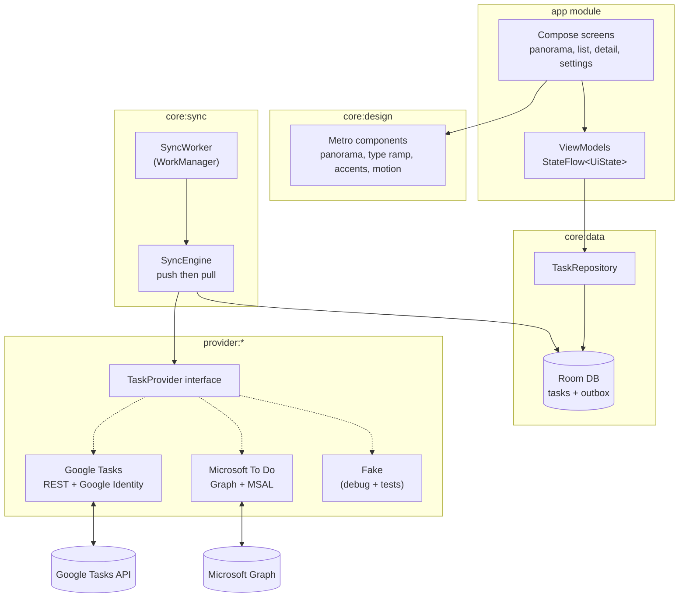
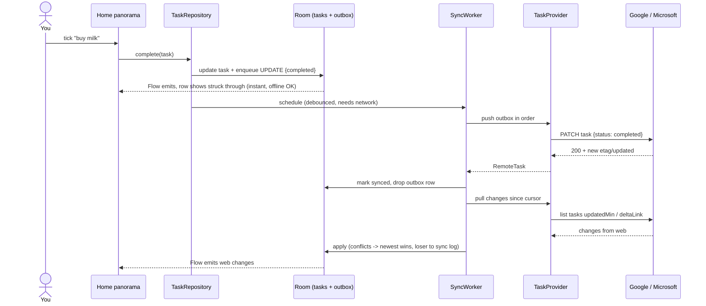
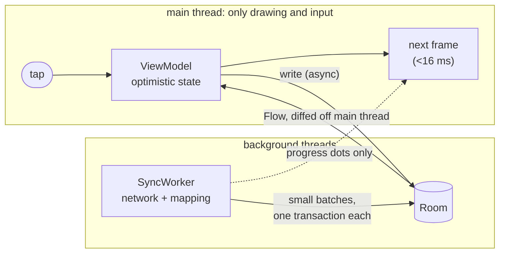
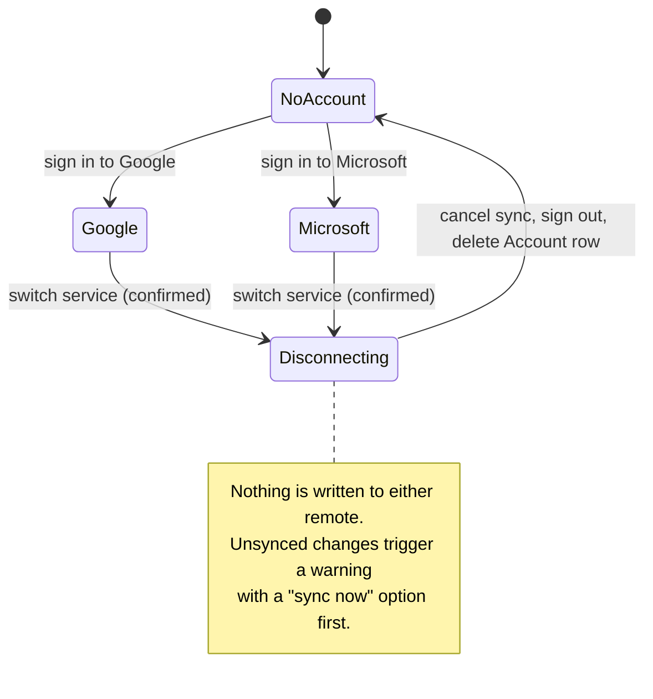
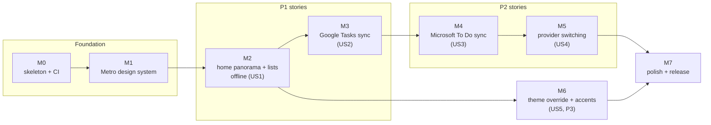

# Implementation Plan: Due North Tasks v1

**Branch**: `001-metro-todo-app` | **Date**: 2026-10-04 | **Spec**: [spec.md](spec.md)

**Input**: Feature specification from `/specs/001-metro-todo-app/spec.md`

## Summary

A native Android app in Kotlin + Jetpack Compose that draws its own Windows Phone 8.1 Metro
components (no Material widgets), keeps all tasks in a local Room database so it works offline,
and runs a background sync engine against exactly one remote: Google Tasks or Microsoft To Do.
Both remotes sit behind one `TaskProvider` interface, so the UI and sync engine never know which
one is connected.

**Visual design**: Light Panorama (design C), chosen 2026-10-04. The home screen is a panorama
with "today", "lists" and "done" sections under a huge "due north" title; light and dark themes
that follow the phone's setting by default (with a manual override), and a magenta accent. See [contracts/ui-screens.md](contracts/ui-screens.md).

## Architecture



The UI only ever reads Room. The sync engine is the only thing that talks to a provider, and it is
handed exactly one `TaskProvider`, chosen from the single `Account` row.

## How a change flows



## Keeping it fast

Speed is a top priority (constitution Principle II). The rule that makes it work: **the screen
only ever talks to the local database, and sync only ever talks to the database too.** Neither
waits for the other.



| Moment | What the user sees | How |
|---|---|---|
| Tap a checkbox | Ticked in the same frame, strike-through animates | ViewModel updates state first, Room write follows on a background dispatcher |
| Open the app | Last tasks show at once | Room read starts in `Application.onCreate`; Baseline Profile; no network on the launch path |
| First sync, big account | Lists appear one by one, today first | Pull pages per list, today's tasks first, commit each page in its own transaction |
| Sync while scrolling | No jumps; new items fade in when the scroll stops | Stable keys in lazy lists, `animateItem()`, updates to the touched list held while a gesture is active |
| Something is slow | Task-shaped placeholders fade into real rows | Placeholders sized like real rows so nothing shifts |
| Page change | Turnstile at full frame rate | Next page's data preloaded on press-down; animations use `graphicsLayer` only |

## Switching provider (one at a time)



## Technical Context

**Language/Version**: Kotlin 2.x, JVM target 17

**Primary Dependencies**: Jetpack Compose (foundation, animation, no Material), Navigation
Compose, Hilt, Room, WorkManager, Retrofit + OkHttp + kotlinx.serialization, Google Identity
Services (Credential Manager + AuthorizationClient), MSAL for Android

**Storage**: Room (SQLite) on device; DataStore for theme and accent

**Testing**: JUnit 5, Turbine, MockWebServer, Robolectric + Roborazzi screenshots, Compose UI
tests

**Target Platform**: Android 8.0 (API 26) and newer, phones, portrait

**Project Type**: mobile app (single Android app, multi-module Gradle)

**Performance Goals** (top priority): cold start ≤ 1s, warm start ≤ 300ms, tap feedback ≤ 100ms,
60fps (90/120 where available) with <1% janky frames while scrolling, swiping and syncing

**Constraints**: offline-capable; one provider at a time; minimal OAuth scopes; no backend server
of our own

**Scale/Scope**: one user per install; about 10 screens; up to ~5,000 tasks per account

## Constitution Check

*GATE: Must pass before Phase 0 research. Re-check after Phase 1 design.*

| Principle | Gate | Status |
|---|---|---|
| I. Metro is the product | Design system module built before features; no Material components; mockups exist | Pass (`core:design` is Phase 2; mockups in `docs/design/`) |
| II. Fast and fluid | Optimistic local writes; sync off the main thread in small batches; macrobenchmark budgets in CI from M1 | Pass (see "Keeping it fast" below and research R12) |
| III. One provider at a time | Single `Account` row; providers behind `TaskProvider`; switch clears data | Pass (see data model and state diagram above) |
| IV. Offline first | UI reads Room only; outbox; remote-wins rule with logged conflicts | Pass (research R9) |
| V. Test the seams | Shared provider contract tests; sync engine against fake; screenshot tests | Pass (research R10) |
| VI. Small and simple | Module count justified below; v1 excludes reminders, recurrence, widgets | Pass with note (see Complexity Tracking) |

Post-design re-check: still passing after data-model and contracts.

## Project Structure

### Documentation (this feature)

```text
specs/001-metro-todo-app/
├── plan.md              # This file
├── research.md          # Phase 0: decisions and API facts
├── data-model.md        # Phase 1: Room schema, task states, field mapping
├── quickstart.md        # Phase 1: how to run and validate
├── contracts/
│   ├── task-provider.md # the provider seam
│   └── ui-screens.md    # screens, navigation, app bars
├── checklists/
│   └── requirements.md
└── tasks.md             # Phase 2: ordered task list
```

### Source Code (repository root)

```text
settings.gradle.kts
gradle/libs.versions.toml
app/                                  # Activity, navigation, screens, ViewModels
  src/main/kotlin/app/duenorth/tasks/
    ui/home/  ui/list/  ui/detail/  ui/search/  ui/settings/  ui/sync/
core/design/                          # Metro theme, type ramp, components, motion
  src/main/kotlin/.../design/{theme,components,motion}/
  src/main/res/font/selawik_*.ttf
core/data/                            # Room entities, DAOs, TaskRepository
core/sync/                            # SyncEngine, SyncWorker, conflict resolver
provider/api/                         # TaskProvider, models, errors, contract tests (testFixtures)
provider/google/                      # Google Tasks REST + auth
provider/microsoft/                   # Graph To Do + MSAL
provider/fake/                        # in-memory provider for debug and tests
docs/design/                          # mockups and Metro reference notes
```

**Structure Decision**: Multi-module single app. The `provider:*` split enforces Principle III at
compile time (the app module depends only on `provider:api`; the concrete providers are wired in
by Hilt). `core:design` is separate so it can be built, previewed and screenshot-tested before any
feature exists. The package name `app.duenorth.tasks` is a placeholder until the Play listing is
decided.

## Delivery roadmap

Each milestone ends with something you can install and try.



| Milestone | You can try | Spec stories |
|---|---|---|
| M0 | An empty black app that builds in CI | none |
| M1 | A "component gallery" screen showing every Metro control, including the panorama, light and dark; performance benchmarks running in CI | FR-001..005 |
| M2 | The home panorama (today, lists, done) and list pages on the debug demo account, fully offline | US1 |
| M3 | Your real Google Tasks, both ways | US2 |
| M4 | Your real Microsoft To Do, both ways | US3 |
| M5 | Switch between them from settings | US4 |
| M6 | Override light/dark by hand and pick another accent | US5 |
| M7 | Play Store internal-testing build | SC-001..009 |

## External setup you will need

1. **Google Cloud**: a project with the Google Tasks API enabled, an OAuth consent screen
   (scope `.../auth/tasks`, which Google treats as sensitive, so public release needs verification;
   testing mode with your own account works immediately), and an Android OAuth client with the
   package name and the debug/release SHA-1.
2. **Microsoft Entra**: an app registration for "personal and work/school accounts", Android
   platform redirect URI from the package name + signature hash, delegated permission
   `Tasks.ReadWrite`.
3. Client IDs go in `local.properties` / CI secrets, never in git (constitution).

## Complexity Tracking

| Violation | Why Needed | Simpler Alternative Rejected Because |
|---|---|---|
| 8 Gradle modules | Provider isolation is a non-negotiable principle; design system must be testable alone | A single module cannot stop UI code importing Google/MSAL types |
