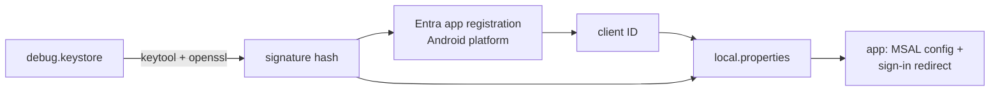

# Quickstart: build, run and validate

## Prerequisites

- Android Studio (latest stable) with JDK 17, an emulator or phone on Android 8.0+.
- For real sync: the Google and Microsoft client IDs from [plan.md](plan.md#external-setup-you-will-need),
  added to `local.properties`:

```properties
google.webClientId=...apps.googleusercontent.com
msal.clientId=00000000-0000-0000-0000-000000000000
msal.signatureHash=...
```

CI reads the same values from the environment variables `GOOGLE_WEBCLIENTID`, `MSAL_CLIENTID`
and `MSAL_SIGNATUREHASH`. Builds without them still compile; sign-in just won't work.

### Microsoft To Do: the two values



1. Get the signature hash of the key that signs your build (debug key shown; the password is
   `android`):
   `keytool -exportcert -alias androiddebugkey -keystore ~/.android/debug.keystore | openssl sha1 -binary | openssl base64`
2. Sign in at https://entra.microsoft.com with your Microsoft account (if it says you need a
   directory, create a free Azure account first), then App registrations > New registration:
   name "Due North Tasks", supported accounts "any organizational directory and personal
   Microsoft accounts", no redirect URI yet. Register.
3. In the new app: Authentication > Add a platform > Android. Package name `app.duenorth.tasks`,
   signature hash from step 1. Save.
4. API permissions > Add a permission > Microsoft Graph > Delegated > `Tasks.ReadWrite`. Add.
5. Copy the Application (client) ID from Overview into `msal.clientId`, and the hash into
   `msal.signatureHash`. A release key has its own hash: add it as a second Android redirect.

## Commands

```bash
./gradlew assembleDebug            # build
./gradlew test                     # unit + contract + sync tests
./gradlew verifyRoborazziDebug     # screenshot tests (dark + light)
./gradlew ktlintCheck lint         # style and Android Lint
./gradlew installDebug             # put it on the device
```

## Validation scenarios

| # | Scenario | Expected |
|---|---|---|
| V1 | Debug build, choose "demo account" | Home panorama shows today, lists and done with sample data; all of US1's acceptance scenarios pass in airplane mode |
| V2 | Open the component gallery (debug menu) | Every component in research R3 renders in light and dark; matches `docs/design/metro-mockups.svg` |
| V3 | Sign in to Google with a test account | Existing lists appear; a task added on the phone appears at tasks.google.com within a minute |
| V4 | Complete a task on the web, pull to refresh | Task moves to "completed" on the phone |
| V5 | Edit the same task on web and phone while offline, reconnect | Newest edit wins; the other is in settings > sync log |
| V6 | Sign in to Microsoft with a test account | Lists, steps and importance appear and sync both ways |
| V7 | Settings > sync account > pick the other service | Warning dialog; after confirming, no old-provider data remains (check `adb shell run-as ... ls databases` row counts) |
| V8 | Developer options > animator duration scale off | All transitions become instant |
| V9 | `./gradlew :core:sync:test --tests '*Soak*'` | 200-operation soak passes with zero duplicates or losses (SC-004) |
