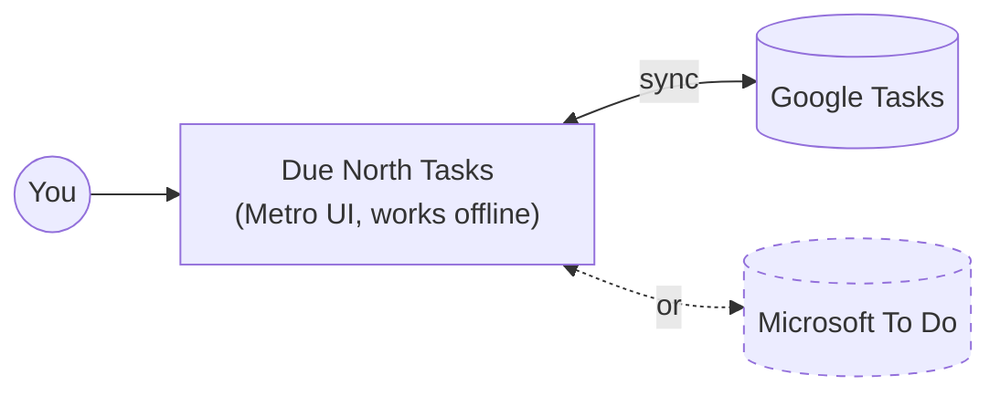

# Feature Specification: Due North Tasks v1 (Metro todo app with single-provider sync)

**Feature Branch**: `001-metro-todo-app`

**Created**: 2026-10-04

**Status**: Draft

**Input**: User description: "I want to build an android todo app that syncs with either google tasks
or ms todo, but not both at the same time. I want to make sure it uses the Metro design language
used in windows phone 8.1."

## At a glance

Exactly one of the two remotes is connected at any moment. The dashed line is the one you are
not using.

## User Scenarios & Testing *(mandatory)*

### User Story 1 - Manage tasks in a Metro interface (Priority: P1)

A person opens the app and lands on a Windows Phone style Panorama (the "Light Panorama" design):
a huge thin "due north" title runs across the top, and they swipe sideways through three
sections. **today** shows what is due today or overdue across all lists, then tomorrow. **lists**
shows each list as a colored square (the app accent, unless the person gave that list its own color) with its open-task count, its name and the next task due.
**done** shows recently completed tasks. Tapping a list opens it as its own page. They add a task
by typing a title in the "add a task" box at the top of today and pressing enter. If they want
more, an "add details" link appears under the box as soon as they type, and tapping it grows the
same box to hold free-text details, a due date and a list. Tasks with details show the first two
lines of them in the list. They tick a task off with a tap, open it to read or edit everything, and
delete it. Everything looks and moves like a Windows Phone 8.1 app: white background,
one accent color, big thin type, flat squares, turnstile transitions.

**Why this priority**: The Metro experience is the whole reason for the app. Without it, any
existing Google Tasks or To Do client already exists.

**Independent Test**: Run a debug build with the built-in demo account (no network). Create two
lists and five tasks, complete two, edit one, delete one, and compare each screen against the
Metro reference mockups in `docs/design/`.

**Acceptance Scenarios**:

1. **Given** the home panorama is on "today", **When** the user swipes left, **Then** the "lists"
   section slides in, the "due north" title moves more slowly than the content (parallax), and the
   "done" header peeks in from the right edge.
2. **Given** tasks due today and one overdue task exist in different lists, **When** the user opens
   the app, **Then** "today" lists all of them, the overdue one first with its due caption in red.
3. **Given** the user taps a list tile, **When** the list page opens, **Then** its tasks appear with
   a staggered slide-in.
4. **Given** "today" is showing, **When** the user types a title in the "add a task" box and
   presses enter, **Then** the task appears in today immediately, due today, in the default list.
4a. **Given** the user has typed a title, **When** they tap "add details", **Then** the same box
   expands in place with a details area, due date and list chips, "hide details" and "add"; a
   hint says details sync as the task's notes in the connected service. Tapping "add" adds the
   task with its details.
4b. **Given** a task has details, **When** it appears in a list, **Then** the first two lines of
   its details show in grey between the title and the caption; a task without details stays one
   line.
4c. **Given** the user taps a task with details, **When** the task page opens, **Then** it shows
   the full details text with tappable links.
5. **Given** an open task, **When** the user taps its checkbox, **Then** it moves to the list's
   "completed" group and to the panorama's "done" section, and the change survives an app restart.
6. **Given** any screen, **When** the user taps the app bar ellipsis (`•••`), **Then** the app bar
   expands to show button labels and the overflow menu, as on Windows Phone.
7. **Given** the device has no network, **When** the user does any of the above, **Then** every
   action still succeeds locally.

---

### User Story 2 - Sync with Google Tasks (Priority: P1)

On first launch the person chooses "google tasks", signs in with their Google account, and sees
their existing Google task lists and tasks in the Metro UI. Changes they make on the phone show up
in Gmail/Google Calendar's Tasks panel, and changes made there show up on the phone.

**Why this priority**: The app is useless as a daily driver without a real backend, and Google
Tasks is the first provider named.

**Independent Test**: Sign in with a test Google account that already has lists. Verify they
appear, add a task on the phone and see it in Google Tasks on the web, then complete a task on the
web and see it complete on the phone after a refresh.

**Acceptance Scenarios**:

1. **Given** a fresh install, **When** the user picks Google Tasks and grants access, **Then** all of
   their lists and open tasks appear within one sync.
2. **Given** the user edits a task offline, **When** the network returns, **Then** the edit reaches
   Google Tasks without the user doing anything.
3. **Given** a task was changed on the web and on the phone since the last sync, **When** sync
   runs, **Then** the most recent change wins and the other is recorded in the sync log.
4. **Given** a Google subtask exists, **When** it is shown on the phone, **Then** it appears as a
   step under its parent task.

---

### User Story 3 - Sync with Microsoft To Do (Priority: P2)

Instead of Google, the person chooses "microsoft to do" and signs in with a personal Microsoft
account or a work/school account. Lists, tasks, steps, importance and due dates sync both ways.

**Why this priority**: It is the second provider the user asked for, and it reuses everything built
for Story 2, so it lands after the sync engine is proven.

**Independent Test**: Sign in with a test Microsoft account, then repeat Story 2's test against
To Do on the web, plus starring a task as important on the phone.

**Acceptance Scenarios**:

1. **Given** a fresh install, **When** the user picks Microsoft To Do and signs in, **Then** their
   lists (including the default "Tasks" list) appear.
2. **Given** To Do is connected, **When** the user marks a task important, **Then** it shows as
   important in To Do on the web.
3. **Given** a task has checklist steps in To Do, **When** it is opened on the phone, **Then** the
   steps appear and can be ticked off.

---

### User Story 4 - Switch provider, never both (Priority: P2)

The person decides to move from Google Tasks to Microsoft To Do (or back). In settings they tap
"switch service". The app explains that the current account will be disconnected and its tasks
removed from this phone (they stay in the cloud), then lets them sign in to the other service.

**Why this priority**: "Not both at the same time" is an explicit requirement, and the switch is
the only place it is visible to the user.

**Independent Test**: Connected to Google, switch to Microsoft. Confirm no Google data remains on
the device, no data was written to either remote by the switch itself, and Microsoft data now
shows.

**Acceptance Scenarios**:

1. **Given** Google is connected, **When** the user opens settings, **Then** there is no way to add
   Microsoft without first disconnecting Google.
2. **Given** the user confirms the switch, **When** it completes, **Then** Google tokens are revoked
   locally, Google tasks are cleared from the device, and the Microsoft sign-in starts.
3. **Given** there are local changes not yet synced, **When** the user starts a switch, **Then** the
   app warns how many changes would be lost and offers "sync now" first.

---

### User Story 5 - Make it mine: theme and accent (Priority: P3)

Like Windows Phone's "start + theme" settings, the person picks light or dark background and one of
22 accent colors: the Windows Phone set plus light orange and coral. The whole app, including checkboxes, the progress dots and the
launcher icon tint where Android allows, follows that choice.

**Why this priority**: It is a signature Windows Phone touch but the app works without it (light +
magenta default, theme following the phone).

**Independent Test**: With the phone in light mode, choose dark in the app and the cobalt accent; every screen reflects it after one
tap, with no restart.

**Acceptance Scenarios**:

1. **Given** default settings, **When** the app first opens, **Then** it matches the phone's
   light or dark setting, with the magenta accent, and changes with it.
2. **Given** the app is dark (from the phone or the user's choice), **When** any screen shows, **Then** the background is pure
   black and the accent uses its brighter dark-theme value (magenta becomes `#F0389A`).
3. **Given** the user picks an accent, **When** they go back, **Then** every accent-colored element
   uses the new color, except lists that have their own color.
4. **Given** all lists use the app accent, **When** the user long-presses the Errands tile and picks
   coral under "list color", **Then** the Errands tile, its list page and its tasks' due captions
   turn coral, and every other list keeps the app accent.
5. **Given** Errands is coral, **When** the user picks "app accent" for it, **Then** it follows the
   app accent again.

### Edge Cases

- Remote list deleted on the web while the phone has unsynced tasks in it: the tasks are moved to
  a local "recovered" list and the user is told once.
- Token expired or access revoked on the web: sync stops, a Metro-style banner says "sign in
  again", and local edits keep queuing.
- Provider-only fields: Microsoft importance and reminders are shown only while To Do is connected;
  Google has no equivalent, so the star is hidden in Google mode rather than faked.
- Google stores due dates without a time; To Do stores date and time. The app edits due **dates**
  only in v1 so nothing is silently truncated.
- Deep Google subtask trees are not possible (Google allows one level), and To Do steps cannot have
  their own notes or dates; steps are title + done only in v1.
- Large accounts (thousands of tasks): first sync is paged and the UI shows lists as soon as they
  arrive.
- User switches provider while a sync is running: the switch waits for the sync to finish or
  cancels it cleanly; it never leaves half of one account on the device.
- Fields the app does not model (Google links, To Do categories, recurrence, attachments) are never
  overwritten or erased by an edit from the app.

## Requirements *(mandatory)*

### Functional Requirements

**Design language**

- **FR-001**: Every screen MUST use the Windows Phone 8.1 Metro design language defined in the
  constitution (Principle I) and the reference mockups in `docs/design/`.
- **FR-002**: The home screen MUST be a Panorama with an oversized "due north" title and three
  sections, "today", "lists" and "done", swiped sideways with parallax; the next section MUST be
  partly visible at the right edge.
- **FR-002a**: "today" MUST show open tasks that are overdue or due today across all lists
  (overdue first, captioned in red), followed by tasks due tomorrow.
- **FR-002b**: "lists" MUST show each list as a square in that list's color (the app accent unless
  changed) with its open-task count, the list name and its next task, plus a "new list" row.
- **FR-002c**: "done" MUST show recently completed tasks, newest first.
- **FR-003**: Primary actions MUST live in a bottom Application Bar with circular outlined icon
  buttons and an ellipsis that reveals labels and an overflow menu.
- **FR-004**: The app MUST support light and dark themes, following the phone's setting by
  default with a manual light/dark override, and 22 accent colors (the 20 Windows Phone accents
  plus light orange and coral), magenta by default. Each accent MUST have a light-theme and a dark-theme value that
  meets 4.5:1 contrast for caption text. Every screen MUST be designed, mocked up and screenshot-tested in
  both light and dark modes.
- **FR-005**: Page transitions MUST use turnstile animations, pressable items MUST tilt on press,
  and all motion MUST be disabled when the system "remove animations" setting is on.

**Speed and smoothness (top priority, constitution Principle II)**

- **FR-006**: Every tap MUST show visible feedback within 100 ms, and every task change MUST
  appear on screen immediately, before the provider confirms it.
- **FR-007**: Scrolling, swiping the panorama and page transitions MUST stay smooth (no dropped
  frames on a mid-range phone), including while a sync is running.
- **FR-008**: Sync MUST NOT block input, show a full-screen spinner, or move items the user is
  looking at or touching. Remote changes MUST fade in place; a list the user is scrolling or
  dragging is updated when they stop.
- **FR-009**: On launch the app MUST show the last known tasks at once; anything still loading
  MUST use task-shaped placeholders, never a blank screen or a layout that jumps.
- **FR-009a**: The first sync of a large account MUST show lists as soon as each arrives, newest
  and today's tasks first, with the progress dots as the only indicator.

**Tasks and lists**

- **FR-010**: Users MUST be able to create, rename and delete task lists.
- **FR-010a**: Every list MUST use the app accent by default. Users MUST be able to give any list
  its own color from the same 22 accents, or reset it to "app accent". A list's color is used for
  its tile, its list page and the due captions of its tasks everywhere (including "today");
  app-wide controls (add box, links, buttons) keep the app accent.
- **FR-010b**: List colors MUST be stored only on the phone (neither Google Tasks nor Microsoft To
  Do can store them), keyed by service and list so they come back after switching services and
  back, and included in Android backup.
- **FR-011**: Users MUST be able to create, edit, complete, un-complete and delete tasks with a
  title, optional details (multi-line plain text, synced as the provider's notes), an optional
  due date and optional steps (title + done).
- **FR-011a**: "today" MUST start with an "add a task" box: enter adds the task with just a title.
  Once the user types, an accent "add details" link MUST appear under the box; tapping it expands
  the box in place with details, due date and list, without leaving the screen.
- **FR-011b**: Task rows MUST show the first two lines of a task's details, if any, between the
  title and the caption.
- **FR-012**: Completed tasks MUST be shown in a collapsible "completed" group at the bottom of a
  list.
- **FR-013**: Users MUST be able to sort a list by "my order", due date, or title.
- **FR-014**: When Microsoft To Do is connected, users MUST be able to mark tasks important.
- **FR-015**: Users MUST be able to search task titles and details across all lists from the app
  bar.

**Sync**

- **FR-020**: The app MUST connect to exactly one provider at a time: Google Tasks or Microsoft To Do.
- **FR-021**: All task actions MUST work offline and sync automatically when a connection is
  available, plus on pull-to-refresh and when the app is opened.
- **FR-022**: Sync MUST be two-way and MUST NOT create duplicates when retried.
- **FR-023**: When the same task changed on both sides, the most recent change MUST win and the
  overwritten version MUST be kept in a viewable sync log.
- **FR-024**: Edits from the app MUST change only the fields the user changed on the remote.
- **FR-025**: Switching provider MUST disconnect and clear the previous provider's data from the
  device before connecting the new one, and MUST NOT write anything to either remote as part of
  the switch.
- **FR-026**: Users MUST be able to sign out, which clears all synced data from the device.
- **FR-027**: The sync account page MUST show both services as a single choice (radio), say
  which account is signed in, and let the user set how often background sync runs and whether
  it runs on Wi-Fi only.

**Privacy**

- **FR-030**: The app MUST request only the permission scope needed to read and write tasks.
- **FR-031**: The app MUST NOT send task data anywhere except the connected provider.

### Key Entities

- **Account**: the one connected provider (Google or Microsoft), the signed-in identity, and the
  sync state. At most one exists.
- **Task list**: a named collection of tasks belonging to the account.
- **Task**: title, details (the provider's notes), due date, completed state, importance (To Do only), position, and steps.
- **Step**: a small checklist item inside a task (Google subtask or To Do checklist item).
- **Pending change**: a local edit not yet confirmed by the provider.
- **Sync log entry**: a record of a conflict or failure the user can review.

## Success Criteria *(mandatory)*

### Measurable Outcomes

- **SC-001**: A new user can go from install to seeing their existing tasks in under 2 minutes.
- **SC-002**: Adding a task takes no more than 2 taps plus typing.
- **SC-003**: A change made on the phone appears on the provider's website within 1 minute when
  online; a change made on the web appears on the phone within 1 minute of opening the app.
- **SC-004**: Zero duplicated or lost tasks across a scripted 200-operation sync soak test with
  random offline periods, for each provider.
- **SC-005**: Screens scroll at a steady 60 frames per second (90/120 on high-refresh phones)
  with 1,000 tasks in a list on a mid-range phone, with under 1% janky frames, including while
  a sync of 500 changed tasks is applied.
- **SC-007**: Cold start to a usable home screen takes at most 1 second; warm start at most
  300 ms (mid-range phone, Pixel 6a class).
- **SC-008**: Tap-to-feedback is at most 100 ms and a completed or added task appears on screen
  within one frame of the tap, online or offline.
- **SC-009**: In usability testing, no participant reports the app "freezing" or "jumping"
  during sync.
- **SC-006**: In a side-by-side review against Windows Phone 8.1 reference screenshots, a person
  who used Windows Phone identifies the app as "Metro" on every core screen.

## Assumptions

- No local-only mode in v1: the person connects Google or Microsoft on first launch (a demo
  account exists only in debug builds for development and testing).
- Switching provider does not copy tasks from one service to the other. A one-time "copy my
  lists" import is a candidate for a later feature.
- The chosen visual design is "Light Panorama" (design C), picked 2026-10-04. Its mockups are in
  `docs/design/` and the design canvas linked from there.
- Due dates are date-only in v1, because Google Tasks drops the time of day. The design mockups
  show times ("5:00 pm"); those appear only if timed due dates are added later for To Do; reminders, recurrence, attachments and live tiles / home-screen
  widgets are out of scope for v1.
- The Segoe fonts are not licensed for redistribution, so an open-licensed look-alike is used.
- Phone portrait layout only in v1.
- Requires Android 8.0 or newer.
