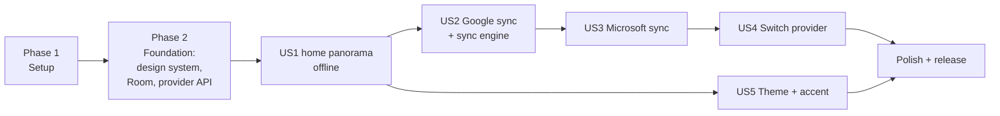

---

description: "Task list for Due North Tasks v1"
---

# Tasks: Due North Tasks v1

**Input**: Design documents from `/specs/001-metro-todo-app/`

**Prerequisites**: [plan.md](plan.md), [spec.md](spec.md), [research.md](research.md),
[data-model.md](data-model.md), [contracts/](contracts/)

**Tests**: Included, because constitution Principle V requires contract, sync and screenshot tests.

**Organization**: Grouped by user story so each story can be built and tried on its own.

## Format: `[ID] [P?] [Story] Description`

- **[P]**: Can run in parallel (different files, no dependencies)
- **[Story]**: US1..US5 from spec.md

## Dependency map

---

## Phase 1: Setup (M0)

**Purpose**: An empty app that builds in CI.

- [X] T001 Create Gradle multi-module project per plan.md: `settings.gradle.kts`, `app`, `core:design`, `core:data`, `core:sync`, `provider:api`, `provider:google`, `provider:microsoft`, `provider:fake`
- [X] T002 Add version catalog `gradle/libs.versions.toml` (Compose BOM, Hilt, Room, WorkManager, Retrofit, OkHttp, kotlinx.serialization, MSAL, Google Identity, Credential Manager, JUnit 5, Turbine, Robolectric, Roborazzi)
- [X] T003 [P] Configure ktlint, Android Lint baseline and a module-dependency rule that fails if `app` or `core:*` depends on `provider:google` / `provider:microsoft` types (only DI wiring in `app/di/ProviderModule.kt` may)
- [X] T004 [P] GitHub Actions workflow `.github/workflows/ci.yml`: build, unit tests, screenshot verify, lint
- [X] T005 [P] `:benchmark` module with Macrobenchmark + Baseline Profile generator; CI job on a Gradle Managed Device that fails when a budget in plan.md is exceeded; `StrictMode` (main-thread disk/network) and JankStats in debug builds
- [X] T006 [P] `local.properties` loading for client IDs into `BuildConfig`, with documented sample in quickstart.md

**Checkpoint**: CI green on an empty black activity.

---

## Phase 2: Foundational (M1)

**Purpose**: Metro design system, local database, provider seam. Blocks every story.

### Metro design system (`core:design`)

- [ ] T007 Bundle Selawik fonts in `core/design/src/main/res/font/` and define type ramp `MetroTypography.kt` (research R2). Type ramp done; fonts still to add (falls back to the platform sans-serif until then)
- [X] T008 [P] `MetroColors.kt`: light and dark palettes (follow the system setting by default), 22 accents (WP8.1 set plus light orange and coral) with a light and a dark value each, magenta default (research R5); `MetroTheme` composable with `LocalMetroColors`, `LocalAccent`
- [X] T009 [P] Motion: `motion/Turnstile.kt`, `motion/Tilt.kt` (Modifier.metroTilt), `motion/SlideInStagger.kt`, `motion/Continuum.kt`; all honor animator duration scale
- [X] T010 `components/MetroPanorama.kt` (wide snapping scroller, screen-wide sections with a 40dp peek of the next, title layer with ~1/3 speed parallax) and `components/MetroPivot.kt` for settings
- [X] T011 [P] `components/MetroAppBar.kt` (round outlined icon buttons, `•••` expand with labels + menu)
- [X] T012 [P] `components/MetroCheckBox.kt`, `MetroToggle.kt`, `MetroTextField.kt`, `MetroListItem.kt`
- [X] T013 [P] `components/MetroProgressDots.kt`, `MetroDialog.kt`, `MetroContextMenu.kt`
- [X] T014 [P] `components/MetroDatePicker.kt` (looping columns), `MetroAccentGrid.kt`, `MetroShadeRow.kt` (seven shades of the accent), `MetroListTile.kt` (accent square + count), `MetroRadio.kt`
- [X] T015 Component gallery screen `app/src/debug/.../GalleryScreen.kt`
- [X] T016 Roborazzi screenshot tests for every component, light + dark, in `core/design/src/test/` (CI records them as an artifact; golden-image verification starts once baselines are committed)

### Local data (`core:data`)

- [X] T017 Room entities and DAOs per data-model.md: `AccountEntity`, `TaskListEntity`, `TaskEntity`, `StepEntity`, `PendingOperationEntity`, `SyncLogEntity` with cascading FKs from Account
- [X] T018 `TaskRepository` with transactional write + outbox enqueue, outbox coalescing rules, `Flow` reads
- [X] T019 [P] Repository tests: coalescing, create-then-delete cancel, cascade on account delete

### Provider seam (`provider:api`, `provider:fake`)

- [X] T020 `TaskProvider`, `ProviderCapabilities`, models, `TaskPatch`, `ProviderError` per contracts/task-provider.md (sign-in takes a `SignInHost` so the module stays Android-free)
- [X] T021 Abstract `TaskProviderContractTest` in `provider/api/src/testFixtures/`
- [X] T022 `FakeProvider` (in-memory, injectable failures and latency) passing the contract test
- [X] T023 Hilt `ProviderRegistry` that returns the single provider for the `Account` row

- [ ] T024 [P] Benchmarks for the gallery: panorama swipe and turnstile transition hold frame rate (FR-007)

**Checkpoint**: Gallery shows every Metro component; screenshot, contract and performance tests pass.

---

## Phase 3: User Story 1 - Manage tasks in a Metro interface (P1) 🎯 MVP (M2)

**Goal**: A full offline todo app on the debug demo account.

**Independent Test**: spec.md US1; quickstart V1, V2, V8.

- [X] T025 [P] [US1] Compose UI test: swipe the panorama, add, complete, edit, delete a task in `app/src/androidTest/.../HomeFlowTest.kt` (runs under Robolectric in `app/src/testDebug/`, so CI needs no emulator; screen screenshots sit beside it)
- [X] T026 [US1] Navigation graph with turnstile transitions in `app/.../nav/NavGraph.kt`
- [X] T027 [US1] `HomeViewModel` + `HomeScreen` panorama: "today" (overdue first in red, today, tomorrow across all lists), "lists" (tiles with counts and next task, new list row), "done" (recent completions); pull-to-refresh hook (the hook and the sync button arrive with the sync engine in M3)
- [X] T028 [US1] `ListViewModel` + `ListScreen`: one list's tasks, collapsible completed group, sort
- [X] T029 [US1] "add a task" box at the top of today: enter adds (due today, default list); "add details" link appears once typing and expands the box in place with details, due and list chips, "hide details" / "add", and the provider hint; app bar `+` focuses the box
- [X] T030 [US1] `TaskDetailViewModel` + `TaskDetailScreen` with continuum entry: "DUE NORTH · LIST" header, 38sp title, accent due line, full details with tappable links, steps, due and list pickers; app bar mark done / edit / delete
- [X] T031 [P] [US1] Task row details preview: first two lines of details, clamped, grey 14sp, between title and caption
- [X] T032 [P] [US1] Add, rename, delete lists (from the "lists" section and the list page menu)
- [X] T033 [P] [US1] `SearchScreen`: search titles and details across lists (FR-015), with a Room FTS table (shipped as an escaped `LIKE` query instead: substring matches, which FTS tokens miss, and fast enough at ~5k rows)
- [X] T034 [P] [US1] Long-press context menu (edit, delete, move to)
- [X] T035 [US1] Debug-only "demo account" option on the sync account screen, backed by `FakeProvider` with sample data (Google and Microsoft rows show "coming soon" until M3/M4)

- [X] T036 [US1] Speed for US1: optimistic ViewModel state for add/complete/edit (FR-006), launch straight from Room with Baseline Profile (SC-007), task-shaped placeholders (FR-009), stable keys and `animateItem()` in every list (profile generation needs a device; runs with T037)
- [X] T037 [P] [US1] Macrobenchmarks: cold/warm start, 1,000-task scroll, tap-to-tick latency (SC-005, SC-007, SC-008). `StartupBenchmark`, `ScrollBenchmark.scroll`, `TapBenchmark.tapToTick` (the `MetroCheckBox tick` trace section, tap to the first frame drawn ticked; slowest tap per run held to 100 ms), seeded over adb by the benchmark-only `BenchmarkSeedReceiver`

**Checkpoint**: US1 acceptance scenarios pass in airplane mode, within the performance budgets.

---

## Phase 4: User Story 2 - Sync with Google Tasks (P1) (M3)

**Goal**: Real Google Tasks, both ways, plus the sync engine all providers share.

**Independent Test**: spec.md US2; quickstart V3, V4, V5, V9.

### Sync engine (`core:sync`)

- [X] T038 [US2] `SyncEngine`: pull per list with cursor, then push outbox in `seq` order (pull first so an older offline edit cannot overwrite a newer web one, FR-023); map `ProviderError` to actions (contract table)
- [X] T039 [US2] Conflict resolver (remote wins unless newer pending local edit; loser to `SyncLogEntity`)
- [X] T040 [US2] `SyncWorker` + `SyncScheduler` (unique work, network constraint, debounce 5s after edits, on foreground, periodic at the user's "sync every" interval, default 15 min, Wi-Fi only if set)
- [X] T041 [P] [US2] Sync engine tests against `FakeProvider`: offline queue, conflict both directions, cursor expired, auth required, recovered-list edge case
- [X] T042 [P] [US2] Soak test `SyncSoakTest.kt`: 200 random ops with random failures, zero duplicates/losses (SC-004)
- [x] T043 [US2] Smooth sync: apply remote changes in ≤50-row transactions, hold updates to a list while the user is touching or flinging it, fade in changed rows, first sync pulls today's tasks first and shows lists as they arrive (FR-008, FR-009a). Engine side done in M3 (`Puller.BATCH`, `ListHolds`, due-soonest first, one list at a time); UI side done in sync polish: today, done and list pages hold their lists through `ListHolds` while touched or flinging and keep showing the rows they had until the finger lifts (`SyncHold.kt`), and rows whose text or date changed fade back in
- [x] T044 [P] [US2] Macrobenchmark "scroll while syncing 500 changes" against `FakeProvider` with latency (SC-005): `ScrollBenchmark.scrollWhileSyncing`, 10 rounds of 50 changes at 150 ms per call, 1% janky-frame budget in `check_benchmark_budgets.py`

### Google provider (`provider:google`)

- [X] T045 [P] [US2] Retrofit `GoogleTasksApi` + DTOs (research R6)
- [X] T046 [US2] `GoogleAuth`: Credential Manager sign-in + `AuthorizationClient` for the `tasks` scope, silent token refresh
- [X] T047 [US2] `GoogleTasksProvider` mapping per data-model.md (subtasks <-> steps, `updatedMin` cursor, `move` for order)
- [X] T048 [P] [US2] MockWebServer fixtures and `GoogleTasksProviderContractTest`
- [X] T049 [US2] Sync account screen (radio choice, "signed in as", sync interval, Wi-Fi only toggle) + first-sync progress (a service whose client ID the build lacks shows "not set up in this build yet"; progress dots on home while `SyncEngine.isSyncing`)

**Checkpoint**: Daily-drivable with a Google account.

---

## Phase 5: User Story 3 - Sync with Microsoft To Do (P2) (M4)

**Independent Test**: spec.md US3; quickstart V6.

- [X] T050 [P] [US3] Retrofit `GraphTodoApi` + DTOs including `$batch` (research R7)
- [X] T051 [US3] `MicrosoftAuth` with MSAL single-account mode, `common` authority, `Tasks.ReadWrite`
- [X] T052 [US3] `MicrosoftTodoProvider` mapping (checklistItems <-> steps, importance, deltaLink cursors, raw status preserved)
- [X] T053 [P] [US3] MockWebServer fixtures and `MicrosoftTodoProviderContractTest` (contract suite runs against `FakeGraphServer`, a stateful Graph stand-in; real-account captures still to replace the fixtures)
- [x] T054 [US3] Importance star in task rows and detail, shown only when `capabilities.importance` (`ServiceFeatures`; row star and "mark important" menu item, "important" toggle on the task page)

**Checkpoint**: Daily-drivable with a Microsoft account.

---

## Phase 6: User Story 4 - Switch provider, never both (P2) (M5)

**Independent Test**: spec.md US4; quickstart V7.

- [X] T055 [P] [US4] Test: switch with pending ops shows warning; confirm clears all tables; no provider write calls recorded on the fake (`ProviderSwitchTest`)
- [X] T056 [US4] `AccountManager.switchProvider()`: cancel unique sync work, sign out, delete Account row, return to "choose a service" (shipped as `AccountSession.signOut()` / `switchTo()` in app)
- [X] T057 [US4] Picking the other service on the sync account screen: Metro confirm dialog with the "your tasks stay in that account" note and the unsynced-changes warning; sign out button
- [ ] T058 [P] [US4] `SyncLogScreen`

---

## Phase 7: User Story 5 - Theme and accent (P3) (M6)

**Independent Test**: spec.md US5.

- [X] T059 [P] [US5] `ThemePreferences` in DataStore (theme: system / light / dark, default system; accent default magenta)
- [X] T060 [US5] Settings "theme" pivot item with a "follow phone / light / dark" choice and `MetroAccentGrid`; live update without restart
- [X] T061 [P] [US5] Screenshot tests for three accents in both themes
- [X] T062 [US5] Per-list shades: `ListShadeStore` in DataStore (step -3..+3) keyed by provider + remote list id (backed up, survives sign-out and switching back); `AccentShades.kt` computes the seven shades per theme with caption-contrast fallback; "list shade" page with `MetroShadeRow` and live preview, from the tile long-press and list page menu; `LocalAccent` provided per list for tiles, list page and task captions
- [X] T063 [P] [US5] Tests: default is step 0, pick and reset, shades follow an app accent change, caption fallback meets 4.5:1 for every accent and step in both themes, key moves from local to remote id after first push, shade survives switching service and back

---

## Phase 8: Polish and release (M7)

- [X] T064 [P] Accessibility pass: TalkBack labels on app bar buttons and checkboxes, 48dp targets, panorama sections announced as headings, contrast check for every accent's light and dark value (`AccessibilityTest`, `ContrastTest`, `HomeFlowTest.everyTapTargetIsLabelledAndAtLeast48dp`)
- [ ] T065 [P] Performance pass on real mid-range and low-end phones: review benchmark trends, JankStats logs and startup traces; fix anything over budget
- [x] T066 [P] Metro launcher icon (flat white glyph on accent square) and splash (adaptive icon with a themed-icon layer; Android 12+ shows it on the theme background as the splash)
- [ ] T067 Privacy policy and Google OAuth verification submission for the `tasks` scope
- [ ] T068 Play Console internal testing track and release signing via CI secrets
- [ ] T069 Run every quickstart.md scenario and record results

---

## Parallel opportunities

- Within Phase 2, the design system (T007-T016), Room (T017-T019) and provider seam (T020-T023) are
  three independent tracks.
- US5 only needs US1, so it can be built alongside US2-US4.
- Within each provider phase, the API/DTO task and the fixture/contract test task run in parallel.

## Implementation strategy

1. Phases 1-2, then US1: you have a Metro todo app you can try offline (MVP demo).
2. US2: switch to using it daily with Google Tasks.
3. US3 + US4: Microsoft To Do and switching.
4. US5 + polish: ship to Play internal testing.
