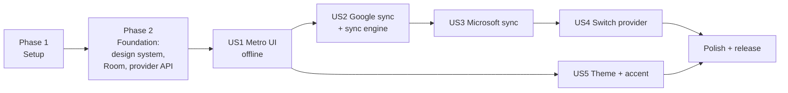

---

description: "Task list for Due North Tasks v1"
---

# Tasks: Due North Tasks v1

**Input**: Design documents from `/specs/001-metro-todo-app/`

**Prerequisites**: [plan.md](plan.md), [spec.md](spec.md), [research.md](research.md),
[data-model.md](data-model.md), [contracts/](contracts/)

**Tests**: Included, because constitution Principle IV requires contract, sync and screenshot tests.

**Organization**: Grouped by user story so each story can be built and tried on its own.

## Format: `[ID] [P?] [Story] Description`

- **[P]**: Can run in parallel (different files, no dependencies)
- **[Story]**: US1..US5 from spec.md

## Dependency map

---

## Phase 1: Setup (M0)

**Purpose**: An empty app that builds in CI.

- [ ] T001 Create Gradle multi-module project per plan.md: `settings.gradle.kts`, `app`, `core:design`, `core:data`, `core:sync`, `provider:api`, `provider:google`, `provider:microsoft`, `provider:fake`
- [ ] T002 Add version catalog `gradle/libs.versions.toml` (Compose BOM, Hilt, Room, WorkManager, Retrofit, OkHttp, kotlinx.serialization, MSAL, Google Identity, Credential Manager, JUnit 5, Turbine, Robolectric, Roborazzi)
- [ ] T003 [P] Configure ktlint, Android Lint baseline and a module-dependency rule that fails if `app` or `core:*` depends on `provider:google` / `provider:microsoft` types (only DI wiring in `app/di/ProviderModule.kt` may)
- [ ] T004 [P] GitHub Actions workflow `.github/workflows/ci.yml`: build, unit tests, screenshot verify, lint
- [ ] T005 [P] `local.properties` loading for client IDs into `BuildConfig`, with documented sample in quickstart.md

**Checkpoint**: CI green on an empty black activity.

---

## Phase 2: Foundational (M1)

**Purpose**: Metro design system, local database, provider seam. Blocks every story.

### Metro design system (`core:design`)

- [ ] T006 Bundle Selawik fonts in `core/design/src/main/res/font/` and define type ramp `MetroTypography.kt` (research R2)
- [ ] T007 [P] `MetroColors.kt`: dark/light palettes and the 20 accents (research R5); `MetroTheme` composable with `LocalMetroColors`, `LocalAccent`
- [ ] T008 [P] Motion: `motion/Turnstile.kt`, `motion/Tilt.kt` (Modifier.metroTilt), `motion/SlideInStagger.kt`, `motion/Continuum.kt`; all honor animator duration scale
- [ ] T009 `components/MetroPivot.kt` (HorizontalPager + synced lowercase headers, inactive 40% opacity, next header bleeds off edge)
- [ ] T010 [P] `components/MetroAppBar.kt` (round outlined icon buttons, `•••` expand with labels + menu)
- [ ] T011 [P] `components/MetroCheckBox.kt`, `MetroToggle.kt`, `MetroTextField.kt`, `MetroListItem.kt`
- [ ] T012 [P] `components/MetroProgressDots.kt`, `MetroDialog.kt`, `MetroContextMenu.kt`
- [ ] T013 [P] `components/MetroDatePicker.kt` (looping columns), `MetroAccentGrid.kt`, `MetroHub.kt`
- [ ] T014 Component gallery screen `app/src/debug/.../GalleryScreen.kt`
- [ ] T015 Roborazzi screenshot tests for every component, dark + light, in `core/design/src/test/`

### Local data (`core:data`)

- [ ] T016 Room entities and DAOs per data-model.md: `AccountEntity`, `TaskListEntity`, `TaskEntity`, `StepEntity`, `PendingOperationEntity`, `SyncLogEntity` with cascading FKs from Account
- [ ] T017 `TaskRepository` with transactional write + outbox enqueue, outbox coalescing rules, `Flow` reads
- [ ] T018 [P] Repository tests: coalescing, create-then-delete cancel, cascade on account delete

### Provider seam (`provider:api`, `provider:fake`)

- [ ] T019 `TaskProvider`, `ProviderCapabilities`, models, `TaskPatch`, `ProviderError` per contracts/task-provider.md
- [ ] T020 Abstract `TaskProviderContractTest` in `provider/api/src/testFixtures/`
- [ ] T021 `FakeProvider` (in-memory, injectable failures and latency) passing the contract test
- [ ] T022 Hilt `ProviderRegistry` that returns the single provider for the `Account` row

**Checkpoint**: Gallery shows every Metro component; screenshot and contract tests pass.

---

## Phase 3: User Story 1 - Manage tasks in a Metro interface (P1) 🎯 MVP (M2)

**Goal**: A full offline todo app on the debug demo account.

**Independent Test**: spec.md US1; quickstart V1, V2, V8.

- [ ] T023 [P] [US1] Compose UI test: add, complete, edit, delete a task on the pivot in `app/src/androidTest/.../PivotFlowTest.kt`
- [ ] T024 [US1] Navigation graph with turnstile transitions in `app/.../nav/NavGraph.kt`
- [ ] T025 [US1] `PivotViewModel` + `PivotScreen` (lists as pivot items, completed group, sort, pull-to-refresh hook)
- [ ] T026 [US1] Quick add from app bar `+` (inline Metro text field, keyboard up, enter adds)
- [ ] T027 [US1] `TaskDetailViewModel` + `TaskDetailScreen` with continuum entry, notes, due date picker, steps editor
- [ ] T028 [P] [US1] `ListsScreen`: add, rename, delete lists
- [ ] T029 [P] [US1] Long-press context menu (edit, delete, move to)
- [ ] T030 [US1] Debug-only "demo account" option on welcome screen, backed by `FakeProvider` with sample data

**Checkpoint**: US1 acceptance scenarios pass in airplane mode.

---

## Phase 4: User Story 2 - Sync with Google Tasks (P1) (M3)

**Goal**: Real Google Tasks, both ways, plus the sync engine all providers share.

**Independent Test**: spec.md US2; quickstart V3, V4, V5, V9.

### Sync engine (`core:sync`)

- [ ] T031 [US2] `SyncEngine`: push outbox in `seq` order, then pull per list with cursor; map `ProviderError` to actions (contract table)
- [ ] T032 [US2] Conflict resolver (remote wins unless newer pending local edit; loser to `SyncLogEntity`)
- [ ] T033 [US2] `SyncWorker` + `SyncScheduler` (unique work, network constraint, debounce 5s after edits, on foreground, periodic 30 min unmetered)
- [ ] T034 [P] [US2] Sync engine tests against `FakeProvider`: offline queue, conflict both directions, cursor expired, auth required, recovered-list edge case
- [ ] T035 [P] [US2] Soak test `SyncSoakTest.kt`: 200 random ops with random failures, zero duplicates/losses (SC-004)

### Google provider (`provider:google`)

- [ ] T036 [P] [US2] Retrofit `GoogleTasksApi` + DTOs (research R6)
- [ ] T037 [US2] `GoogleAuth`: Credential Manager sign-in + `AuthorizationClient` for the `tasks` scope, silent token refresh
- [ ] T038 [US2] `GoogleTasksProvider` mapping per data-model.md (subtasks <-> steps, `updatedMin` cursor, `move` for order)
- [ ] T039 [P] [US2] MockWebServer fixtures and `GoogleTasksProviderContractTest`
- [ ] T040 [US2] Welcome hub + "choose a service" + first-sync progress screens

**Checkpoint**: Daily-drivable with a Google account.

---

## Phase 5: User Story 3 - Sync with Microsoft To Do (P2) (M4)

**Independent Test**: spec.md US3; quickstart V6.

- [ ] T041 [P] [US3] Retrofit `GraphTodoApi` + DTOs including `$batch` (research R7)
- [ ] T042 [US3] `MicrosoftAuth` with MSAL single-account mode, `common` authority, `Tasks.ReadWrite`
- [ ] T043 [US3] `MicrosoftTodoProvider` mapping (checklistItems <-> steps, importance, deltaLink cursors, raw status preserved)
- [ ] T044 [P] [US3] MockWebServer fixtures and `MicrosoftTodoProviderContractTest`
- [ ] T045 [US3] Importance star in pivot rows and detail, shown only when `capabilities.importance`

**Checkpoint**: Daily-drivable with a Microsoft account.

---

## Phase 6: User Story 4 - Switch provider, never both (P2) (M5)

**Independent Test**: spec.md US4; quickstart V7.

- [ ] T046 [P] [US4] Test: switch with pending ops shows warning; confirm clears all tables; no provider write calls recorded on the fake
- [ ] T047 [US4] `AccountManager.switchProvider()`: cancel unique sync work, sign out, delete Account row, return to "choose a service"
- [ ] T048 [US4] Settings "account" pivot item: connected service, sign out, switch service, sync log entry point
- [ ] T049 [P] [US4] `SyncLogScreen`

---

## Phase 7: User Story 5 - Theme and accent (P3) (M6)

**Independent Test**: spec.md US5.

- [ ] T050 [P] [US5] `ThemePreferences` in DataStore (dark default, cobalt default)
- [ ] T051 [US5] Settings "theme" pivot item with background toggle and `MetroAccentGrid`; live update without restart
- [ ] T052 [P] [US5] Screenshot tests for three accents in both themes

---

## Phase 8: Polish and release (M7)

- [ ] T053 [P] Accessibility pass: TalkBack labels on app bar buttons and checkboxes, 48dp targets, contrast check for every accent on both backgrounds (some, like yellow on white, need a darker variant for text)
- [ ] T054 [P] Performance: baseline profile, 1,000-task list benchmark (SC-005)
- [ ] T055 [P] Metro launcher icon (flat white glyph on accent square) and splash
- [ ] T056 Privacy policy and Google OAuth verification submission for the `tasks` scope
- [ ] T057 Play Console internal testing track and release signing via CI secrets
- [ ] T058 Run every quickstart.md scenario and record results

---

## Parallel opportunities

- Within Phase 2, the design system (T006-T015), Room (T016-T018) and provider seam (T019-T022) are
  three independent tracks.
- US5 only needs US1, so it can be built alongside US2-US4.
- Within each provider phase, the API/DTO task and the fixture/contract test task run in parallel.

## Implementation strategy

1. Phases 1-2, then US1: you have a Metro todo app you can try offline (MVP demo).
2. US2: switch to using it daily with Google Tasks.
3. US3 + US4: Microsoft To Do and switching.
4. US5 + polish: ship to Play internal testing.
