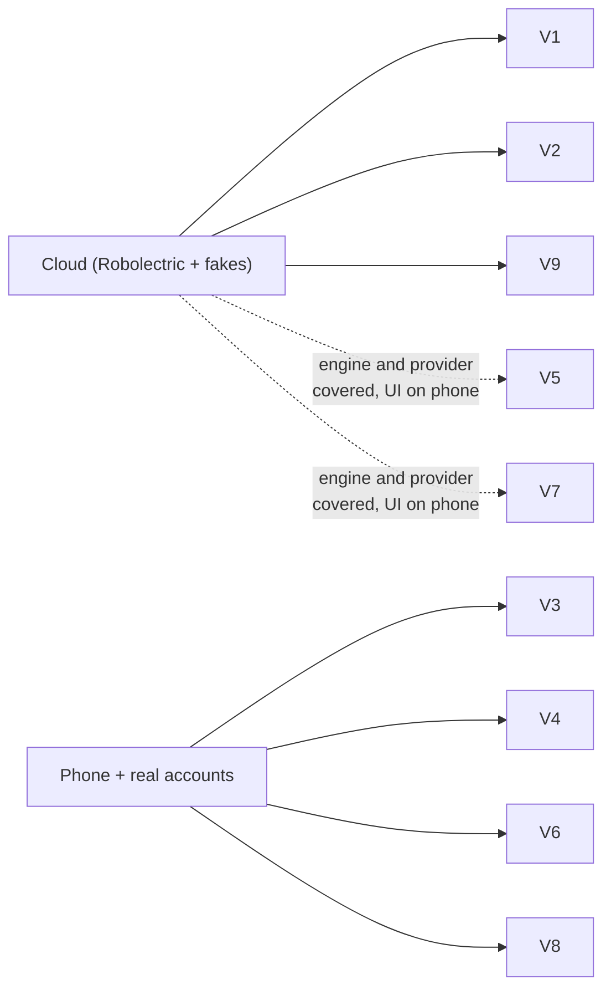

# Validation results (T069)

The [quickstart](quickstart.md) scenarios, run on 2026-10-05 against `main` at the release-prep
PR. The cloud build has no emulator (no KVM), so scenarios that need a real phone and real
accounts are listed with what to check and stay open until someone runs them on a device.

| # | Scenario | Result | Evidence |
|---|---|---|---|
| V1 | Demo account, offline home panorama | Pass (cloud) | `HomeFlowTest` (4 tests: add, complete, edit, delete, swipe; sync waits for the finger; star; 48dp labelled targets), `ScreenScreenshotTest` (15 screens, light and dark) |
| V2 | Component gallery, light and dark | Pass (cloud) | `MetroComponentScreenshotTest` (19 components × light and dark) |
| V3 | Google sign-in, lists appear, phone task reaches tasks.google.com | Partly: sign-in confirmed on the owner's phone 2026-10-05; sync covered by fakes | `GoogleTasksProviderContractTest` (11), `SyncEngineTest` (26). **Phone**: add a task, see it on tasks.google.com within a minute |
| V4 | Complete on the web, pull to refresh | Phone | `SyncEngineTest` covers remote completion. **Phone**: complete on the web, pull down, task moves to done |
| V5 | Same task edited on web and phone offline | Engine passes (cloud) | `SyncEngineTest` conflict cases, `SyncLogFormatTest`. **Phone**: newest edit wins, the other shows in settings > sync log |
| V6 | Microsoft sign-in, lists, steps, importance both ways | Partly: sign-in confirmed on the owner's phone 2026-10-05; sync covered by fakes | `MicrosoftTodoProviderContractTest` (11), `FirstSyncTest`. **Phone**: steps and the importance star round-trip |
| V7 | Switch service from settings | Pass (cloud) | `ProviderSwitchTest` (warns about unsynced changes, clears everything, pushes nothing). **Phone**: row counts after switching |
| V8 | Animator duration scale off | Phone | `LocalAnimationsEnabled` reads the setting. **Phone**: developer options > animator duration scale off, every transition is instant |
| V9 | 200-operation soak | Pass (cloud) | `SyncSoakTest.twoHundredRandomOperations`, debug and release |

Full local run that day: 467 unit, contract and screenshot tests passing, ktlint, module
boundaries, Android Lint, debug, release and benchmark builds, and the signed release bundle.
