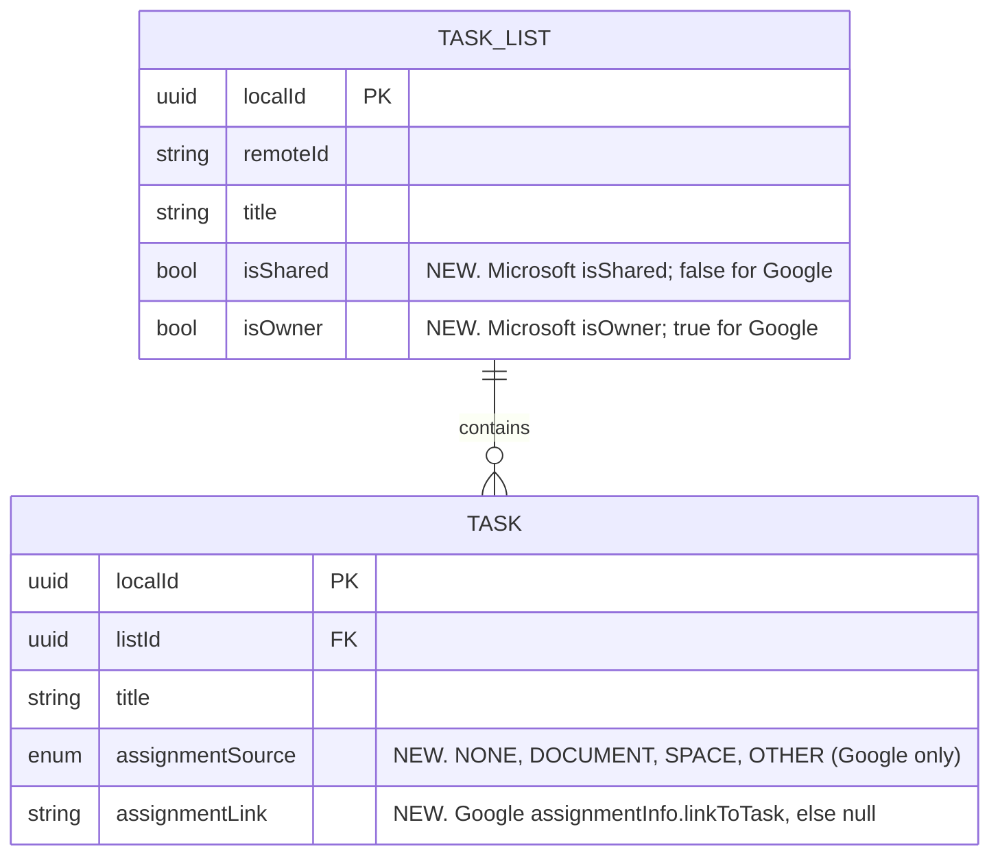

# Data Model: Shared lists

Changes to the spec 001 schema ([001 data-model](../001-metro-todo-app/data-model.md)). Additive
only; one Room migration.



## Provider mapping

| Local | Google Tasks | Microsoft To Do |
|---|---|---|
| TaskList.isShared | always `false` (lists can't be shared) | `todoTaskList.isShared` (missing → `false`) |
| TaskList.isOwner | always `true` | `todoTaskList.isOwner` (missing → `true`) |
| Task.assignmentSource | `assignmentInfo.surfaceType` (`DOCUMENT`, `SPACE`; `GMAIL`/unknown → `OTHER`; no `assignmentInfo` → `NONE`) | always `NONE` (not in the API) |
| Task.assignmentLink | `assignmentInfo.linkToTask` | always null |

## Provider seam (`provider:api`)

```kotlin
data class RemoteList(
    /* existing fields */
    val isShared: Boolean = false,
    val isOwner: Boolean = true,
)

data class RemoteTask(
    /* existing fields */
    val assignment: Assignment? = null,   // read-only, never sent back
)

data class Assignment(val source: AssignmentSource, val link: String?)
enum class AssignmentSource { DOCUMENT, SPACE, OTHER }

data class ProviderCapabilities(
    /* existing fields */
    val sharedLists: Boolean,     // MICROSOFT=true, GOOGLE=false
    val assignedTasks: Boolean,   // GOOGLE=true, MICROSOFT=false
)

sealed class ProviderError {
    /* existing cases */
    /** The service refused this one change (403 that isn't a rate limit). Sync carries on. */
    class NotAllowed(val id: String, cause: Throwable? = null)
}
```

`NotAllowed` changes the errors table in `contracts/task-provider.md`: Microsoft 403 and Google
403 (non-rate-limit) move from `AuthRequired` to `NotAllowed`; 401 stays `AuthRequired`. The
contract test suite gains a case for it.

## Rules

- Sharing fields are **read-only**. The app never writes `isShared`, `isOwner` or assignment
  info to a provider; `ListPatch` and `TaskPatch` don't gain fields.
- Sharing fields are **replaced on every lists pull**, not merged, so a list that stops being
  shared is unmarked on the next sync.
- They are synced data, so sign-out and provider switch clear them (unlike list shades).
- Room migration: add the four columns with defaults (`isShared=0`, `isOwner=1`,
  `assignmentSource='NONE'`, `assignmentLink=NULL`). No backfill needed; the next sync fills them.
