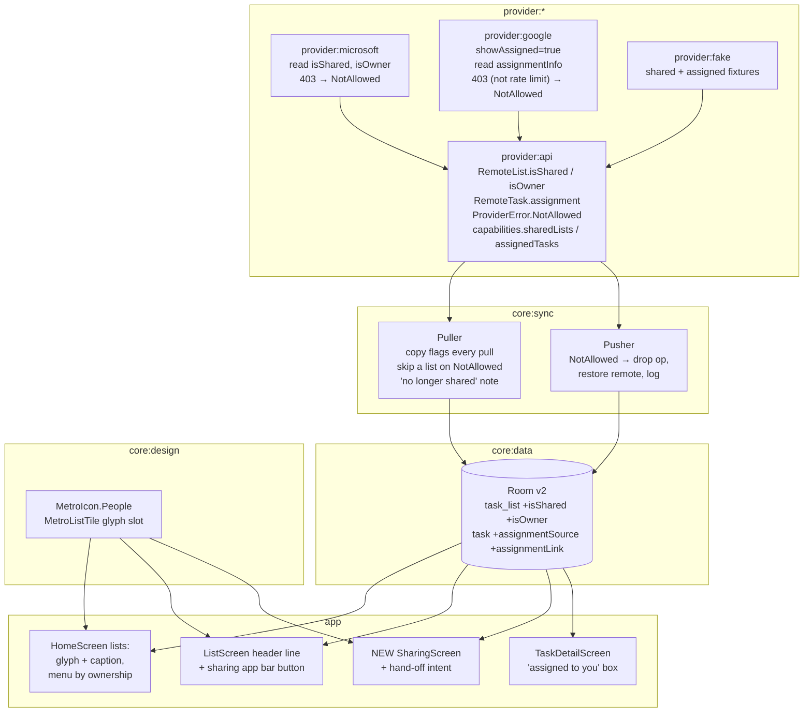
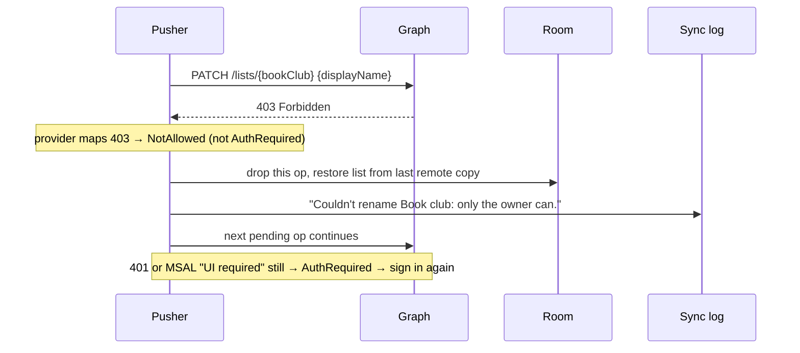

# Implementation Plan: Shared lists

**Branch**: `002-shared-lists` | **Date**: 2026-10-06 | **Spec**: [spec.md](spec.md)

**Input**: Feature specification from `/specs/002-shared-lists/spec.md` (approved by Dustin
2026-10-06)

## Summary

Keep the sharing facts the providers already send (Microsoft `isShared` / `isOwner`, Google
`assignmentInfo`), store them on the existing list and task rows, and show them with one new
Metro glyph, two caption variants, and a new "sharing" page. Separately, give the provider seam a
`NotAllowed` error so a refused change in someone else's list costs one change, not the whole
sync. No new network calls for Microsoft; one extra query parameter for Google.

## What changes where



## How a "not allowed" change is handled

Today (research R6) a 403 becomes `AuthRequired` and stops all syncing. After:



Restoring "from last remote copy" uses the row's remote fields for a list rename; for a task
change it clears the task's pending op and lets the pull that follows overwrite it, the same way a
`Conflict` loser is handled today.

## Technical Context

**Language/Version**: Kotlin (unchanged)

**Primary Dependencies**: unchanged. No new libraries.

**Storage**: Room schema 1 → 2 via `@AutoMigration` (four added columns with defaults; schema JSON
is already exported to `core/data/schemas/`).

**Testing**: provider contract tests (new `NotAllowed` mapping and new fields), sync engine
tests against the fake, Roborazzi screenshots of the new states in light and dark, migration test
1 → 2.

**Performance Goals**: spec 001 budgets unchanged (SC-104). The glyph is a cached vector draw in
the tile; captions are precomputed in the ViewModel's row model, not in composition.

**Constraints**: no member data is stored or displayed (FR-111). Sharing fields are never sent to
a provider.

## Constitution Check

| Principle | Gate | Status |
|---|---|---|
| I. Metro is the product | New glyph in `core:design`, outlined with square caps like the rest; new page uses the existing page header, type ramp and app bar; light and dark mockups exist | Pass |
| II. Fast and fluid | No extra Microsoft requests; Google adds a query flag, not a call; marks fade in place; no new work on the main thread | Pass |
| III. One provider at a time | All sharing behavior sits behind `TaskProvider` capabilities; UI checks `capabilities`, never provider types | Pass |
| IV. Offline first | Marks are read from Room; the hand-off link is the only network-dependent action and it leaves the app | Pass |
| V. Test the seams | `NotAllowed` and the new fields join the shared contract suite; fake grows shared and assigned fixtures | Pass |
| VI. Small and simple | No new module; four columns; nothing stored that the providers don't send | Pass |

Post-design re-check: passing.

## Project Structure

### Documentation (this feature)

```text
specs/002-shared-lists/
├── spec.md
├── research.md        # provider API facts and "verify live" items
├── data-model.md      # columns, mapping, provider seam
├── plan.md            # this file
├── tasks.md
├── checklists/requirements.md
└── mockups/           # generate_mockups.py → .svg and .png
```

### Source code touched

```text
provider/api/        TaskProvider.kt (capabilities), Models.kt (RemoteList, RemoteTask, Assignment),
                     ProviderError.kt (NotAllowed), testFixtures contract suite
provider/microsoft/  graph/GraphModels.kt, TodoMapping.kt, graph/GraphClient.kt (403 mapping)
provider/google/     GoogleTasksApi.kt (showAssigned, assignmentInfo DTO), GoogleTasksClient.kt,
                     GoogleErrors.kt (403 mapping)
provider/fake/       FakeProvider.kt
core/data/           db/Entities.kt, db/DueNorthDatabase.kt (v2 + AutoMigration), schemas/2.json
core/sync/           Puller.kt, Pusher.kt, SyncEngine.kt (NotAllowed never reaches AuthRequired path)
core/design/         components/MetroIcons.kt (People), components/MetroListTile.kt (glyph slot)
app/                 ui/home/HomeScreen.kt, ui/list/ListScreen.kt, ui/detail/TaskDetailScreen.kt,
                     ui/common/TaskRows.kt (caption), new ui/sharing/SharingScreen.kt + ViewModel,
                     nav/NavGraph.kt, nav/Page.kt
```

## Sequencing and coordination

- **Wait for the "Microsoft To Do sync" thread.** It is changing provider and sync code now. Phase
  2 of tasks.md (provider and sync changes) starts from `main` after that thread's PR merges, to
  avoid conflicting edits in `provider:microsoft` and `core:sync`.
- **Verify live first.** Before the UI work, capture real Graph responses from Dustin's account:
  a list he owns and shared, a list shared with him, and the response to a member renaming the
  owner's list (expected 403). These become fixtures and settle research R3–R5. Same for one
  Google task assigned from a Doc (R11). If a real response contradicts research.md, update
  research.md and the spec before building on it.
- **One APK owner.** Builds for Dustin go through whichever thread owns `/mnt/project-files/apk/`
  at the time; this feature's thread does not write there unless handed ownership.

## Risks

| Risk | Mitigation |
|---|---|
| Graph returns 400 instead of 403 for a member rename/delete | Map whatever the live capture shows; the UI already hides those actions, so this only affects stale queued ops |
| A real 403 means a revoked consent, not a per-item refusal | Only map 403 to `NotAllowed` when the request targets a list or task; a 403 on `GET /me/todo/lists` stays `AuthRequired` |
| `showAssigned` tasks can't be moved or deleted | Hide move for assigned tasks if the live check shows refusal; `NotAllowed` covers the rest |
| To Do deep link to a list is not stable | Fall back to opening To Do's home (FR-112 allows it) |

## Complexity Tracking

None.
