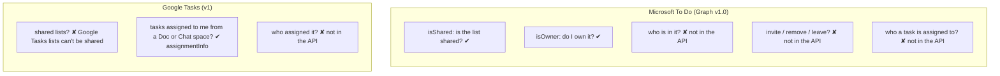
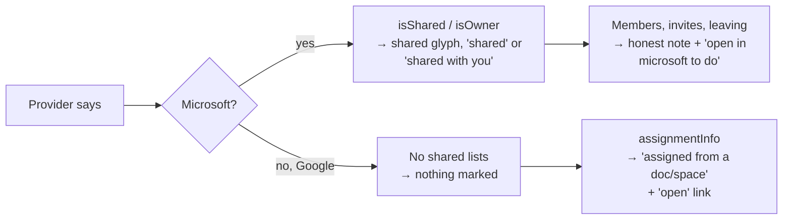

# Research: What each provider exposes about sharing

Input for [spec.md](spec.md). Checked 2026-10-05 against the providers' published API reference
(sources at the bottom). Anything marked **verify live** is not stated in the docs and must be
confirmed against a real account before the plan relies on it.

## Summary

| Question | Microsoft To Do | Google Tasks |
|---|---|---|
| Can a list be shared at all? | Yes (To Do "share list") | No. Task lists belong to one Google account. |
| Does the API say a list is shared? | Yes: `todoTaskList.isShared` | Not applicable |
| Does the API say who owns it? | Only "is it me": `todoTaskList.isOwner`. No owner name. | Not applicable |
| Does the API list the members? | **No.** No members, permissions or invitations resource exists for To Do lists. | Not applicable |
| Can the app share, invite, remove, stop sharing or leave? | **No.** No endpoint. Only the To Do app or web can. | Not applicable |
| Does the API say who created or is assigned a task? | **No.** `todoTask` has no `createdBy` or assignee field. | Only for tasks assigned to the user from Docs or Chat (`assignmentInfo`), and then only *where* from, not *who*. |
| Does anything change for tasks inside a shared list? | Same `todoTask` resource and endpoints as any list. | Not applicable |

## Microsoft To Do (Graph v1.0)

**R1. List flags.** `todoTaskList` has `displayName`, `id`, `isOwner` (Boolean, "True if the user
is owner of the given task list"), `isShared` (Boolean, "True if the task list is shared with other
users") and `wellknownListName`. Both flags arrive in the `GET /me/todo/lists` call the app already
makes, so showing them costs no extra request (Principle II). Today `TodoTaskListDto`
(`provider/microsoft/.../graph/GraphModels.kt`) ignores them; the test fake already returns
`isOwner: true, isShared: false`.

**R2. No members.** Graph v1.0 has no members, permissions, or invitation relationship on
`todoTaskList`. Member names, avatars and counts cannot be read. This is the direct answer to
"who is it shared with": the app cannot show it for Microsoft and must say so rather than guess.

**R3. No sharing management.** There is no endpoint to create a sharing link, invite, remove a
member, stop sharing, or leave a list. The app can only hand off to Microsoft To Do (the
`com.microsoft.todos` app if installed, otherwise To Do on the web: `to-do.live.com` for personal
accounts, `to-do.office.com` for work or school). A deep link to the exact list is **verify live**;
falling back to To Do's home is acceptable.

**R4. What a non-owner may do.** In To Do, members can add, edit, complete and delete tasks in a
shared list; only the owner can rename the list, delete it or manage sharing. Which HTTP status
Graph returns when a member tries to rename or delete the owner's list (403 is expected; it might
be 400, or a `DELETE` might mean "leave") is **verify live**. The app must not offer those actions
to members, so the answer only matters for edits made before the flag arrived (see R6).

**R5. Change detection.** Turning sharing on or off changes `isShared` on the list. Whether the
lists `delta` call reports that change is **verify live**. The app re-reads all lists on every
sync already (lists are few), so the flag is refreshed regardless.

**R6. 403 handling today.** `GraphClient.kt` maps every 401 **and 403** to
`ProviderError.AuthRequired`, which stops sync and asks the user to sign in again. In a shared
list a 403 means "you aren't allowed to do that to this list", not "your sign-in expired". If a
member's queued rename or delete reaches Graph, the whole account would wrongly be marked
"sign in again". The spec adds a separate "not allowed" outcome (FR-S12). Google's 403 mapping
(`GoogleErrors.kt`) has the same shape, but Google has no shared lists, so it only matters there
for assigned tasks (R9).

**R7. Shared list disappears.** When the owner stops sharing or removes the user, or the user
leaves in To Do, the list simply stops appearing in `GET /me/todo/lists`; requests for it return
404. That is the same path as "list deleted on the web" in spec 001, so the existing recovery rule
applies.

**R8. Not in the API either.** Per-task "assigned to" (a shared-list-only To Do feature), the
member who completed a task, and the list's share link. Because edits are PATCH-only (spec 001
FR-024), the app never clears an assignment it cannot see.

## Google Tasks (v1)

**R9. No shared lists.** The `TaskList` resource has `kind`, `id`, `etag`, `title`, `updated` and
`selfLink`. Google Tasks lists cannot be shared with other people, and nothing in the API refers
to sharing. In Google mode there is nothing to mark as shared.

**R10. Assigned tasks are the closest thing.** Google Docs and Google Chat spaces can assign a
task to a person; it then shows in that person's Google Tasks. The `Task` resource has a read-only
`assignmentInfo` with:
- `linkToTask`: a URL that opens the task where it was assigned (the doc or the space);
- `surfaceType`: `DOCUMENT` or `SPACE` (enum also has `GMAIL` and `CONTEXT_TYPE_UNSPECIFIED`);
- `driveResourceInfo` (`driveFileId`, `resourceKey`) for documents, `spaceInfo` (`space`, a
  `spaces/...` name) for Chat.

It does **not** include the assigner's name or the document's or space's title.

**R11. Assigned tasks are hidden by default.** `tasks.list` returns assigned tasks only with
`showAssigned=true` (default false). The app does not pass it today, so tasks assigned to Dustin
from Docs or Chat are currently missing in Google mode. Which list they live in, and whether
moving or deleting them is refused, is **verify live**.

## What this means for the spec

## Sources

- Microsoft Graph: [todoTaskList resource type](https://learn.microsoft.com/en-us/graph/api/resources/todotasklist),
  [List lists](https://learn.microsoft.com/en-us/graph/api/todo-list-lists)
- Google Tasks: [REST Resource: tasks](https://developers.google.com/workspace/tasks/reference/rest/v1/tasks),
  [Method: tasks.list](https://developers.google.com/workspace/tasks/reference/rest/v1/tasks/list),
  [REST Resource: tasklists](https://developers.google.com/workspace/tasks/reference/rest/v1/tasklists)
