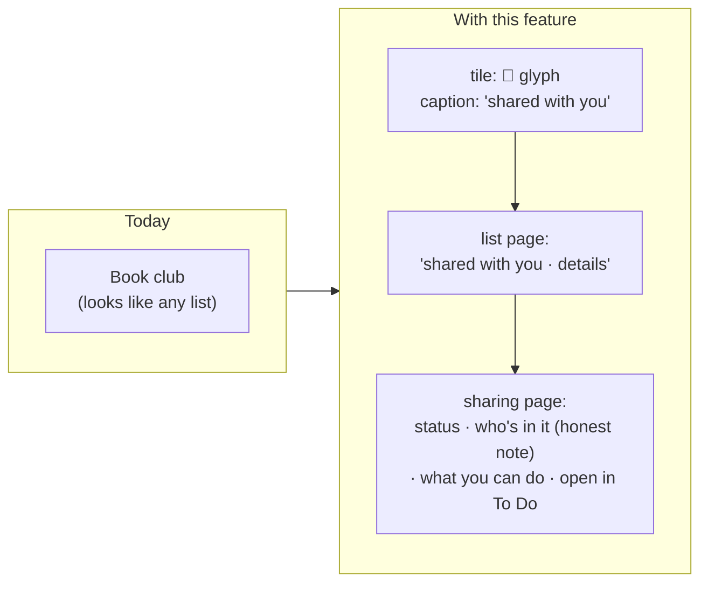

# Feature Specification: Shared lists

**Feature Branch**: `002-shared-lists`

**Created**: 2026-10-05

**Status**: Draft

**Input**: User description: "Create a new spec to fully support shared lists. The lists already
show up in my list, but it doesn't say it is shared, who it is shared with, etc."

## At a glance

Shared lists already sync (they are ordinary lists to the API), but the app throws away the two
facts Microsoft gives about them. This feature keeps those facts, shows them in Metro style, is
honest about what neither service tells other apps, and makes sure a shared list can never trip
the app into a wrong "sign in again".

What each service tells us (details and sources in [research.md](research.md)):

| | Microsoft To Do | Google Tasks |
|---|---|---|
| Is this list shared? | ✔ `isShared` | Lists can't be shared |
| Do I own it? | ✔ `isOwner` (yes/no only) | n/a |
| Who is it shared with? | ✘ not available to apps | n/a |
| Invite, remove, leave, stop sharing | ✘ only in To Do itself | n/a |
| Tasks assigned to me by others | ✘ not available | ✔ from Docs and Chat spaces, source only, not the person |

## User Scenarios & Testing *(mandatory)*

### User Story 1 - See which lists are shared (Priority: P1)

Dustin is connected to Microsoft To Do and has lists he shared with family, plus a list a friend
shared with him. On the home panorama's "lists" section, each shared list's tile carries a small
two-person glyph in its top-left corner, and the line under its name starts with "shared" (a list
he owns) or "shared with you" (someone else's list), followed by the usual "next: ..." task. When
he opens a shared list, the line under its big title says the same thing in the list's shade, and
the app bar has a "sharing" button (the same two-person glyph).

**Why this priority**: This is the gap Dustin reported. It needs only the two flags Microsoft
already sends in the lists call the app makes today, so it adds no network cost.

**Independent Test**: With the fake provider returning one owned shared list, one list shared with
the user, and one private list, check the tiles, captions and list page headers in light and dark
against `mockups/shared-lists-mockups.png`.

**Acceptance Scenarios**:

1. **Given** Microsoft returns a list with `isShared=true, isOwner=true`, **When** the "lists"
   section shows, **Then** its tile has the shared glyph and its caption starts "shared · ".
2. **Given** a list with `isShared=true, isOwner=false`, **When** the "lists" section shows,
   **Then** its tile has the shared glyph and its caption starts "shared with you · ".
3. **Given** a private list (`isShared=false`), **When** it shows, **Then** it looks exactly as it
   does today.
4. **Given** a list is shared or unshared on the web, **When** the next sync finishes, **Then**
   the glyph and caption appear or disappear in place with the usual fade, without moving the row.
5. **Given** a shared list, **When** the user opens it, **Then** the header reads "shared" or
   "shared with you" plus "· details", and tapping that line or the app bar's sharing button opens
   the sharing page.
6. **Given** TalkBack is on, **When** focus reaches a shared tile, **Then** it announces
   "Book club, shared with you, 2 open tasks".

---

### User Story 2 - Understand who and what (Priority: P1)

From a shared list Dustin opens the **sharing** page. It says whether the list is shared by him or
with him. Under "who's in it" it says plainly that Microsoft To Do doesn't tell other apps who a
list is shared with, with an accent link "see people in microsoft to do" that opens the list in the
To Do app (or To Do on the web if the app isn't installed). Under "what you can do here" it lists
what works in Due North for this list and what has to happen in To Do (invite, remove people,
stop sharing, leave). The list-shade swatches live here too, so the page is useful even for lists
that aren't shared.

**Why this priority**: "Who is it shared with" is the other half of Dustin's ask. The API cannot
answer it (research R2), so the best honest answer is a clear explanation and a one-tap way to
the place that can.

**Independent Test**: Open the sharing page for each of the three fake lists in Story 1. Check the
wording, that the link launches an intent for `com.microsoft.todos` when installed and the right
To Do web address otherwise (personal vs work account), and both themes.

**Acceptance Scenarios**:

1. **Given** a list shared with the user, **When** the sharing page opens, **Then** status reads
   "shared with you" / "someone else owns this list".
2. **Given** a list the user owns and shared, **When** the page opens, **Then** status reads
   "shared by you" / "you own this list".
3. **Given** a private list, **When** the page opens (from long-press "list info"), **Then** status
   reads "only you" and the hand-off link reads "share in microsoft to do".
4. **Given** To Do isn't installed, **When** the user taps the hand-off link, **Then** the browser
   opens To Do on the web for the signed-in account type.
5. **Given** any list, **When** the page shows, **Then** no member names, counts or avatars are
   shown or invented.

---

### User Story 3 - Shared lists behave safely (Priority: P2)

Dustin long-presses "Book club" (owned by his friend). The menu offers "list info" and "list
shade" but not "rename" or "delete"; a one-line note says only the owner can change the list. When
he long-presses "Family groceries" (his, shared) and taps delete, the confirmation says it deletes
the list and its tasks for everyone it's shared with. If his friend stops sharing "Book club", it
disappears after the next sync with a one-time note, and any of his unsynced tasks in it are kept
in the existing "recovered" list. Nothing about a shared list can make the app say "sign in again".

**Why this priority**: These are the ways shared lists can go wrong. Today a refused change to
someone else's list would be treated as an expired sign-in and stop all syncing (research R6).

**Independent Test**: Sync engine unit tests against the fake provider: a member rename/delete is
not offered; a forced refused change (fake returns "not allowed") is undone locally and logged
while the rest of the sync continues; a shared list removed remotely follows the recovery path.

**Acceptance Scenarios**:

1. **Given** a list the user doesn't own, **When** they long-press it or open its app bar menu,
   **Then** "rename" and "delete" are absent, and "only the owner can rename or delete this list"
   is shown in their place.
2. **Given** a shared list the user owns, **When** they confirm delete, **Then** the dialog title
   reads "delete for everyone?" and names how it affects people it's shared with.
3. **Given** the provider refuses a change because the user isn't allowed (Graph 403 on a list or
   task), **When** sync handles it, **Then** the local change is rolled back to the remote copy,
   a sync log entry explains it, the account stays signed in, and other pending changes still go.
4. **Given** a genuine expired sign-in (401, or MSAL says sign-in is needed), **When** sync runs,
   **Then** it still stops and asks to sign in again, as today.
5. **Given** a shared list stops appearing in the provider's lists, **When** sync finishes,
   **Then** the list is removed from the phone, unsynced tasks move to "recovered", and the user
   sees one note: "Book club is no longer shared with you".

---

### User Story 4 - Google: tasks assigned to you (Priority: P3)

Google Tasks has no shared lists, but people can assign Dustin a task from a Google Doc or a Chat
space. With Google connected, those tasks appear in his lists like any task, captioned "assigned
from a google doc" or "assigned from a chat space". The task page has an "assigned to you" box with
an "open in google docs" (or "open in google chat") link, and a note that Google doesn't say who
assigned it.

**Why this priority**: It is Google's only form of shared work and those tasks are currently
missing from the app entirely (research R11), but it is a smaller, separate change and Dustin's
report was about lists.

**Independent Test**: Google contract tests with fixtures containing `assignmentInfo` for a
document and a space; check the caption, the link intent and that ordinary tasks are unchanged.

**Acceptance Scenarios**:

1. **Given** Google is connected, **When** tasks sync, **Then** tasks assigned to the user are
   included (`showAssigned=true`).
2. **Given** a task with `assignmentInfo.surfaceType=DOCUMENT`, **When** it shows in a list,
   **Then** its caption includes "assigned from a google doc", and the task page links to
   `linkToTask`.
3. **Given** Microsoft is connected, **When** any task shows, **Then** no "assigned" text appears.

### Edge Cases

- **Sharing changes while a list is open**: the header line and app bar button appear or vanish
  in place; the user is not navigated away. If the user is removed from a list they're looking at,
  they stay on the page until they leave it, with a banner "no longer shared with you".
- **Ownership flag missing**: if Graph omits `isOwner` or `isShared`, treat the list as private
  and owned (today's behavior) rather than guessing.
- **The default "Tasks" list and "Flagged email"** can't be shared in To Do; they are never marked.
- **A member's queued rename or delete from before this feature shipped**: handled by the "not
  allowed" rule (Story 3, scenario 3), not by sign-out.
- **Offline**: shared marks come from the last sync; nothing about sharing needs the network to
  display. The hand-off link needs the network only once To Do opens.
- **Switching services**: shared flags are cleared with the rest of the account's data; per-list
  shades survive as today.
- **List shades on shared lists** stay phone-only and are never sent to the provider, so other
  members never see them (constitution Principle VI).
- **Accessibility**: the glyph is never the only signal; the caption text says "shared" too, and
  the glyph meets 3:1 against its tile.

## Requirements *(mandatory)*

### Functional Requirements

**Seeing sharing (Microsoft To Do)**

- **FR-101**: The app MUST read `isShared` and `isOwner` for every Microsoft To Do list in the
  lists call it already makes, and MUST NOT add a network request to do so.
- **FR-102**: A shared list's tile MUST show a two-person outline glyph in the tile's top-left
  corner, drawn in the tile's ink color, and its caption MUST begin with "shared" (owned) or
  "shared with you" (not owned).
- **FR-103**: A shared list's page MUST show "shared" or "shared with you" plus "· details" under
  the title, in the list's caption shade, and an app bar "sharing" button. Both open the sharing
  page.
- **FR-104**: Sharing marks MUST update after each sync without moving rows or interrupting the
  user (constitution Principle II).

**Explaining sharing**

- **FR-110**: The app MUST provide a **sharing** page for every list (reached from the list page,
  and from a new "list info" long-press item) with: status (shared by you, shared with you, or only
  you), "who's in it", "what you can do here", and the list-shade swatches.
- **FR-111**: For Microsoft To Do, "who's in it" MUST say that To Do doesn't share member names
  with other apps and MUST offer a link to view people in Microsoft To Do. The app MUST NOT show,
  store or invent member names, counts or avatars.
- **FR-112**: The hand-off link MUST open the Microsoft To Do app when installed, otherwise To Do
  on the web for the account type (personal: `to-do.live.com`, work or school:
  `to-do.office.com`), opening the specific list if a stable deep link exists (research R3).
- **FR-113**: In Google mode the sharing page MUST say Google Tasks lists can't be shared and show
  only the status "only you" and list shade; no hand-off link.

**Acting safely**

- **FR-120**: For lists the user does not own, the app MUST NOT offer rename or delete, and MUST
  say that only the owner can.
- **FR-121**: Deleting a shared list the user owns MUST use a confirmation that says it is deleted
  for everyone it's shared with.
- **FR-122**: The provider seam MUST distinguish "not allowed" (Graph 403, Google 403 that isn't a
  rate limit) from "sign-in needed" (401, MSAL UI required). On "not allowed" the sync engine MUST
  drop that one pending change, restore the remote copy locally, write a sync log entry, and carry
  on. It MUST NOT mark the account as needing sign-in.
- **FR-123**: When a shared list stops appearing remotely, the app MUST follow the spec 001
  "recovered" rule for unsynced tasks and show one note naming the list.
- **FR-124**: Tasks in shared lists MUST keep the PATCH-only rule (spec 001 FR-024), so fields the
  app can't see (for example To Do's task assignment) are never cleared.

**Google assigned tasks**

- **FR-130**: In Google mode the app MUST request assigned tasks (`showAssigned=true`) and keep
  each task's assignment source (document or space) and `linkToTask`.
- **FR-131**: Assigned tasks MUST show "assigned from a google doc" or "assigned from a chat space"
  in their caption and an "assigned to you" box with an open link on the task page.
- **FR-132**: The app MUST NOT claim to know who assigned a task.

**Design and performance**

- **FR-140**: Every new element (glyph, header line, sharing page, dialogs) MUST follow the Metro
  rules in the constitution and be screenshot-tested in light and dark.
- **FR-141**: The shared glyph MUST be added to the design system's icon set, not drawn ad hoc.
- **FR-142**: Showing sharing marks MUST NOT regress the existing scroll, startup or sync
  benchmarks.

### Key Entities

- **Task list sharing** (new fields on the existing task list): `isShared` and `isOwner`, from
  Microsoft only; Google lists are always "not shared, owned".
- **Task assignment** (new fields on the existing task, Google only): source (document, space,
  other) and a link to open it.

See [data-model.md](data-model.md) for the schema change and provider mapping.

## Success Criteria *(mandatory)*

### Measurable Outcomes

- **SC-101**: Every Microsoft list that To Do shows as shared is marked shared in the app after one
  sync, and no private list is marked (checked against Dustin's own account).
- **SC-102**: From the home screen, a user reaches a list's sharing information in 2 taps.
- **SC-103**: In a scripted test where the provider refuses 20 changes to a list the user doesn't
  own, the account never shows "sign in again" and all other queued changes sync.
- **SC-104**: Scroll and startup benchmarks stay within spec 001's budgets (SC-005, SC-007) with
  10 shared lists on the home screen.
- **SC-105**: In Google mode, every task assigned to the user in Docs or Chat appears in the app
  after one sync.

## Assumptions

- Microsoft's API stays as documented: list-level `isShared` and `isOwner` only, with no members or
  sharing management (research R2, R3). If Microsoft adds a members API later, "who's in it" can
  list names in a follow-up feature; this spec does not reserve space for it.
- Sharing, inviting, removing people and leaving a list are done in Microsoft To Do, not in this
  app. That is a limit of the API, not a design choice.
- The two-person glyph follows the Windows Phone "people" icon style (outlined, square caps).
- Items marked **verify live** in research.md are confirmed against Dustin's account during the
  plan phase before tasks depend on them.
- Out of scope: showing who completed or changed a task, per-task assignment in To Do, a members
  list, and creating shared lists from the app.
