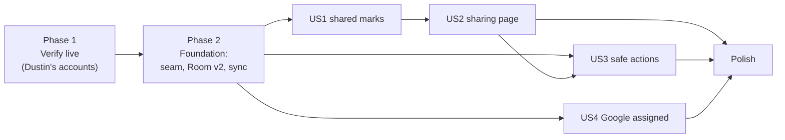

# Tasks: Shared lists

**Input**: Design documents from `/specs/002-shared-lists/`

**Prerequisites**: [plan.md](plan.md), [spec.md](spec.md), [research.md](research.md),
[data-model.md](data-model.md)

**Tests**: Included (constitution Principle V: contract, sync and screenshot tests).

**Numbering**: IDs are prefixed `S` so they don't collide with spec 001's `T` tasks.

## Format: `[ID] [P?] [Story] Description`

- **[P]**: Can run in parallel (different files, no dependencies)
- **[Story]**: US1..US4 from spec.md

## Dependency map

Phase 2 started from `main` after the "Microsoft To Do sync" thread's PR #26 merged (plan.md,
"Sequencing and coordination"). PR #26 already adds `ProviderError.NotAllowed`, maps 403 to it for
both Microsoft and Google, and handles it in the Pusher and Puller with tests; the tasks below
marked **(PR #26)** only need checking against it once it lands.

---

## Phase 1: Verify live (settles research.md "verify live" items)

- [ ] S001 Capture `GET /me/todo/lists` from Dustin's Microsoft account with a debug-only logging interceptor (tokens and personal names redacted); save as `provider/microsoft/src/test/resources/graph/lists_shared.json` with one owned shared list, one list shared with him and one private list
- [ ] S002 Capture the response to renaming and to deleting a list Dustin doesn't own (expected 403); record status and error code in research.md R4 and as fixtures
- [ ] S003 [P] Check whether the lists `delta` link reports an `isShared` change (R5) and whether a To Do deep link to one list works on Android (R3); record results in research.md
- [ ] S004 [P] Capture one Google task assigned from a Doc with `showAssigned=true` (R10, R11), plus the response to moving it to another list; save as `provider/google/src/test/resources/tasks_assigned.json`
- [ ] S005 Update spec.md and research.md for anything the captures contradict

**Checkpoint**: every "verify live" item in research.md has an answer.

---

## Phase 2: Foundation (blocks every story)

- [X] S010 Add `isShared`, `isOwner` to `RemoteList`, `assignment: Assignment?` to `RemoteTask`, `Assignment` + `AssignmentSource` in `provider/api/.../Models.kt`
- [X] S011 Add `sharedLists` and `assignedTasks` to `ProviderCapabilities` in `provider/api/.../TaskProvider.kt`; set them in all three providers
- [X] S012 **(PR #26)** Add `ProviderError.NotAllowed(id)` in `provider/api/.../ProviderError.kt` and update the errors table in `specs/001-metro-todo-app/contracts/task-provider.md`
- [ ] S013 (provider tests cover the mapping; shared contract-suite case still to add) Contract suite (`provider:api` testFixtures): sharing fields round-trip from fixtures; `NotAllowed` mapping case; sharing fields are never present in any request body
- [X] S014 [P] Microsoft: read `isShared` / `isOwner` in `TodoTaskListDto` and `TodoMapping.kt` (missing → private, owned); the 403 → `NotAllowed` mapping in `GraphClient.kt` is in PR #26; decide from S002 whether a 403 on `GET /me/todo/lists` itself should stay `AuthRequired` (PR #26 maps every 403 to `NotAllowed`)
- [X] S015 [P] Google: `showAssigned=true` in `GoogleTasksApi.kt`; `AssignmentInfoDto` and mapping in `GoogleTasksClient.kt`; (the non-rate-limit 403 → `NotAllowed` mapping in `GoogleErrors.kt` is in PR #26)
- [X] S016 [P] Fake provider: configurable shared/owned lists, assigned tasks and a "refuse this id" switch for tests
- [X] S017 Room v2: columns on `TaskListEntity` and `TaskEntity` with defaults, `@AutoMigration(1, 2)`, exported `schemas/.../2.json`, migration test
- [X] S018 Puller: copy sharing fields on every lists pull (replace, not merge); copy assignment on every task pull
- [X] S019 **(PR #26)** Pusher: catch `NotAllowed` like `NotFound` (drop op, restore remote copy, `SyncLogType.ERROR` entry naming the list or task), continue with the next op
- [X] S020 **(PR #26)** Puller: a `NotAllowed` on one list's task pull skips that list with one log entry instead of ending the sync
- [X] S021 Sync engine tests against the fake (PR #26's `ListSyncTest` covers one refused rename): 20 refused changes never set `NEEDS_SIGN_IN` and other ops still push (SC-103); a 401 still does; flags flip after a remote share/unshare

**Checkpoint**: data and sync carry sharing facts; no UI yet.

---

## Phase 3: User Story 1 - See which lists are shared (P1)

- [X] S030 [P] [US1] `MetroIcon.People` glyph in `core/design/.../MetroIcons.kt` (outlined, square caps, 24-unit grid); add to the icon gallery and screenshot tests
- [X] S031 [P] [US1] Optional top-left glyph slot in `MetroListTile` drawn in `onFill`; screenshot tests light/dark, including the lightest and darkest shades (3:1 check)
- [X] S032 [US1] Home "lists" row model: `sharing` state (none / owned / withYou) from Room, caption prefix "shared · " or "shared with you · " in `HomeViewModel` / `HomeScreen.kt`
- [X] S033 [US1] TalkBack label "<name>, shared with you, <n> open tasks" on shared rows
- [X] S034 [US1] List page header line ("shared" / "shared with you" + "· details") in the list's caption shade, and the "sharing" app bar button, in `ListScreen.kt`
- [X] S035 [US1] Fade marks in and out in place when flags change during sync (no row movement); test with `ListHolds`
- [X] S036 [US1] Screenshot tests matching `mockups/shared-lists-mockups.png` columns 1–2, light and dark

**Checkpoint**: Dustin's shared lists are marked on the phone.

---

## Phase 4: User Story 2 - Understand who and what (P1)

- [X] S040 [US2] `SharingScreen` + `SharingViewModel` in `app/.../ui/sharing/`: status, "who's in it", "what you can do here", list shade swatches (reuse `ListShadeViewModel` logic); route in `nav/Page.kt` and `NavGraph.kt`
- [X] S041 [US2] Copy per provider and state (shared by you, shared with you, only you; Google "lists can't be shared") exactly as spec US2 scenarios 1–3 and FR-113
- [X] S042 [US2] Hand-off: intent for `com.microsoft.todos` (list deep link if S003 found one), else browser to `to-do.live.com` (personal account, consumers tenant) or `to-do.office.com` (work/school); unit test the choice
- [X] S043 [US2] "list info" item in the home long-press menu opening the sharing page for any list
- [X] S044 [US2] Screenshot tests for all three states, light and dark (mockup column 3)

**Checkpoint**: from home, sharing info is 2 taps away (SC-102).

---

## Phase 5: User Story 3 - Shared lists behave safely (P2)

- [X] S050 [US3] Hide rename and delete for lists with `isOwner=false` in the home long-press menu and list page menu; show "only the owner can rename or delete this list"
- [X] S051 [US3] Owner delete of a shared list: dialog title "delete for everyone?" and message naming the people it's shared with (generic, no names)
- [X] S052 [US3] "No longer shared with you" note: when a list with `isShared=true, isOwner=false` disappears remotely, use that wording in the recovery log and the one-time banner (extend `Puller` recovery path)
- [ ] S053 [US3] Banner on an open list page whose list was removed, user stays on the page until they leave. **Deferred**: the page still closes itself as in spec 001; the sync log note (S052) says why
- [X] S054 [US3] Tests: menus by ownership; removal wording; a queued member rename from before the update ends as a logged `NotAllowed`, not a sign-out

---

## Phase 6: User Story 4 - Google: tasks assigned to you (P3)

- [X] S060 [US4] Task row caption "assigned from a google doc" / "assigned from a chat space" in `ui/common/TaskRows.kt` when `assignmentSource != NONE`
- [X] S061 [US4] "assigned to you" box on `TaskDetailScreen` with "open in google docs" / "open in google chat" link to `assignmentLink` and the "Google doesn't say who assigned it" note
- [ ] S062 [US4] (waits on S004) Hide "move to list" for assigned tasks if S004 showed moves are refused
- [X] S063 [US4] Screenshot tests (mockup column 4) and a check that Microsoft mode never shows "assigned"

---

## Phase 7: Polish

- [ ] S070 Run benchmarks with 10 shared lists in the seed; confirm spec 001 SC-005 and SC-007 budgets hold (SC-104)
- [ ] S071 Check SC-101 on Dustin's account: every list To Do shows as shared is marked, no private list is
- [X] S072 Update `specs/001-metro-todo-app/contracts/ui-screens.md` with the sharing page and new menu items
- [ ] S073 Dark-theme before/after screenshots in the implementation PR (constitution workflow rule)
