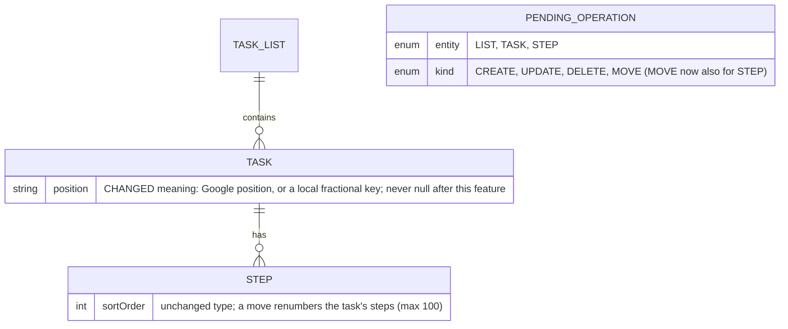

# Data Model changes: Reordering

Builds on [spec 001's data model](../001-metro-todo-app/data-model.md). Only the changes are
listed.

## Room

| Table | Change | Why |
|---|---|---|
| `task` | `position` is always set. Google mode: Google's value, or a local key placed between the neighbors until the move is pushed and pulled back. Microsoft mode: local key only, never overwritten by a pull. | Stable "my order" in both modes (FR-220, FR-223). |
| `step` | No schema change. A move renumbers `sortOrder` for that task's steps in one transaction (at most 100 rows, Validation.MAX_STEPS). Pulls keep the phone's order for Microsoft and while a step `MOVE` is pending. | Avoids a Room migration; 100 small rows is far under a frame. |
| `pending_operation` | `MOVE` allowed for `STEP`. Coalescing as for tasks: one waiting `MOVE` per entity, sent with the entity's place at push time. | FR-222. |

Pull rules:

- Google: a pulled `position` replaces the local key unless a `MOVE` for that task or step is
  waiting (then the local one wins and a `CONFLICT` is logged; FR-226, FR-227).
- Microsoft: a pulled task or step keeps its local key; a new one gets a key at the top (tasks) or
  bottom (steps). On the very first sync, tasks are keyed newest-created first (FR-224).

## Phone-only preferences (DataStore)

Next to the list shades map (spec 001, "List shades"):

| Key | Value | Notes |
|---|---|---|
| `list_order` | map from `"<provider>:<remote list id>"` to a fractional key | Same keying as shades, same move from `"local:<localId>"` after the first push, same Auto Backup. Lists missing from the map sort after the ordered ones: default list first, then by title (today's order). |
| `order_note_shown` | boolean | FR-231, per phone. |

## Provider seam

No new `TaskProvider` methods for tasks: `moveTask(listId, id, afterId)` exists. Steps need a way
to move a subtask; the plan chooses between a `StepPatch.Move(id, afterId)` entry (fits the
existing step patch flow) and a separate `moveStep` method. `ProviderCapabilities.manualOrder`
(true for Google, false for Microsoft) decides whether a `MOVE` is sent at all; the fake provider
supports it so the contract suite covers it (Principle V).
