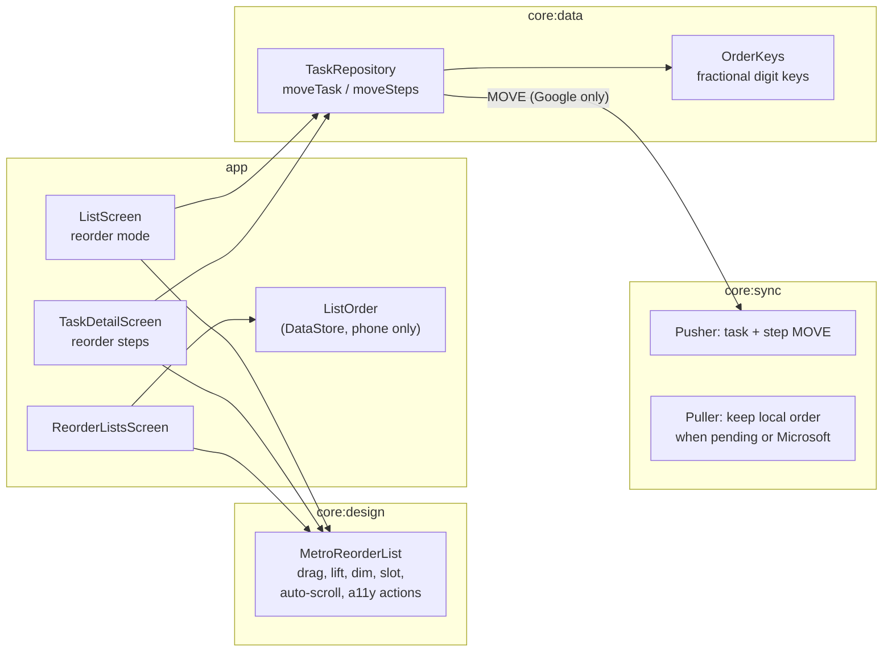

# Implementation Plan: Reordering tasks, lists and steps

**Branch**: `003-reordering` (git: `claude/reordering-spec-xsfrn2`) | **Date**: 2026-10-06 | **Spec**: [spec.md](spec.md)

## Summary

One reusable Metro reorder list in `core:design` drives three screens: the list page (tasks), the
task page (steps) and a new "reorder lists" page. Every drop writes the new order to Room (tasks,
steps) or DataStore (lists) at once. In Google mode a task or step drop also queues a `MOVE` that
the existing outbox pushes with `tasks.move`; in Microsoft mode nothing is sent and pulls leave
the phone's order alone.

## Technical decisions

| Decision | Choice | Why |
|---|---|---|
| Task order key | Reuse `task.position` (TEXT). Keys are digit strings compared as decimal fractions; `OrderKeys.between(a, b)` returns a key strictly between two neighbors without renumbering. | Google positions are fixed-width digit strings, so local keys interleave with them using plain string order. No schema change. |
| Google "move to top" | `position = null` and `localUpdatedAt = now`: null already sorts first (unpushed creates use it), and the pushed `move` with no `previous` lands it first remotely. | Google's first position can be all zeros, so nothing sorts below it. |
| Microsoft task keys | New tasks get a key above the current first task; tasks in a first sync get a key from their creation time (newest first); tasks synced before this feature get keys on the next pull in the order shown today. | Stops "my order" from following the last edit (research R6). |
| Step order | Keep `step.sortOrder INT`; a drop renumbers that task's steps (at most 100 rows). | Avoids a Room migration; one small transaction stays well under a frame. Data model updated. |
| List order | One DataStore string per account key: newline-separated list keys (`"<provider>:<remote id>"`, `"local:<id>"` until adopted), next to list shades. Lists not in it sort after it, default first then title. | Phone-only, survives sign-out and backup, like shades. |
| Drag mechanics | List-level pointer input on the `LazyColumn` (not per row), so moving rows never feed back into the gesture. Gripper zone starts a drag on touch-down; elsewhere after a 150 ms press. Neighbor swap uses the half-height rule (no oscillation between rows of different heights). | Spec FR-205; WP8.1 feel. |
| Steps layout in reorder mode | The task page swaps the step rows for the reorder list and hides the date and list sections, instead of dimming them. | One list implementation with auto-scroll for long checklists. Mockup updated. |
| Sync while reordering | The reorder screen works on its own copy of the rows from the moment the mode opens; synced changes show after done. | FR-228 without a longer `ListHolds` cap. |
| Order conflicts | A pending local move keeps its place when a pull brings another position; the pull's other fields still apply. Not written to the sync log: no user data is lost and the log would fill with every unrelated remote edit. | Recorded in Complexity Tracking against Principle IV. |
| Provider seam | `StepPatch.Move(id, afterId)`; Google sends `tasks.move?parent=&previous=`; Microsoft ignores it (`manualOrder = false`); the fake reorders. `RemoteTask.createdAt` added (Microsoft `createdDateTime`). | Smallest change to the shared seam. |

## Constitution Check

| Principle | Status |
|---|---|
| I. Metro | Pass: WP8.1 reorder mode, flat accent edge, no shadow or elevation, light and dark mockups and screenshot tests. |
| II. Fast and Fluid | Pass: drops write locally in one transaction; drag runs on graphics-layer offsets; rows are lazy; remove-animations respected. |
| III. One provider | Pass: behavior keyed on `ProviderCapabilities.manualOrder`, never on a provider type in UI or sync. |
| IV. Offline first | Pass with note: see Complexity Tracking. |
| V. Test the seams | Pass: `OrderKeys` unit tests, repository move tests, sync tests for Google push and Microsoft keep-local, fake provider step move. |
| VI. Small and simple | Pass: no migration, no new module, phone-only order is a display preference. |

## Complexity Tracking

| Item | Why | Simpler alternative rejected because |
|---|---|---|
| Pending local move beats a remote position without a sync-log entry | Order isn't content; nothing the user wrote is lost, and the remote order is restored by the next pull once the move is sent. | Logging would add an entry for every remote edit to a task that has a queued move, which buries real conflicts. |
