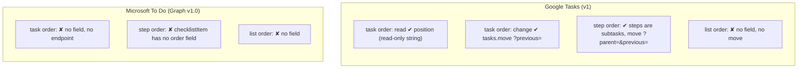

# Research: What each provider lets apps do with order

Input for [spec.md](spec.md). Written 2026-10-06 from the providers' published API reference
(sources at the bottom) and from the code that already talks to them in this repo. The cloud
session that wrote this could not reach the documentation sites directly, so every API claim
below is also cross-checked against what the repo's providers and test fakes already do; items
marked **verify live** must be confirmed against a real account before the plan relies on them.

## Summary

## Google Tasks

**R1. Task order.** Each `task` has `position`: "String indicating the position of the task among
its sibling tasks under the same parent task or at the top level. If this string is greater than
another task's corresponding position string according to lexicographical ordering, the task is
positioned after the other task under the same parent task (or at the top level). Use the move
method to move the task to another position." It is output-only: a `PATCH` that sets it is
ignored. The app already reads it (`RemoteTask.position`, `TaskEntity.position`) and sorts "my
order" by it (`ListViewModel.sorted`).

**R2. Moving a task.** `POST lists/{tasklist}/tasks/{task}/move` with optional query parameters:
`parent` (new parent task; omit to move to the top level), `previous` (new previous sibling; omit
to move to the first position among its siblings) and `destinationTasklist` (move to another
list). The app already has this call (`GoogleTasksApi.moveTask`, `GoogleTasksProvider.moveTask`)
and the outbox already has a task `MOVE` kind that `Pusher.moveTask` sends with `previous`. No
screen enqueues a `MOVE` yet, so this feature mostly needs UI plus local order keys.

- Moving a parent moves its subtasks with it (they stay children).
- One call per move; there is no batch reorder. Moving several tasks is several calls, which the
  outbox already sends in order.
- A moved task's `updated` time changes, so the next `updatedMin` pull on other devices picks up
  the new position. **verify live**: that a move alone bumps `updated` (the fake server assumes it).
- Hidden completed tasks have positions too. Using `previous` = the nearest **open** task above
  the drop point means the moved task lands right after it, whatever completed tasks sit around.

**R3. Steps.** In this app steps are Google subtasks (`parent` set). Their order is their
`position` among siblings, and `move` with `parent` = the task and `previous` = the step above
reorders them. The app already sorts subtasks by `position` when assembling a task
(`GoogleTasksProvider.assemble`) and inserts new steps after the last one with `previous`. Google
allows one level of nesting, so a step can't get steps of its own.

**R4. Lists.** The `TaskList` resource has `kind`, `id`, `etag`, `title`, `updated` and
`selfLink`, and the methods are `get`, `list`, `insert`, `update`, `patch` and `delete`. There is
no order field and no move. The order `tasklists.list` returns is not documented as meaningful.
List order is therefore phone-only on Google too.

## Microsoft To Do (Graph v1.0)

**R5. Steps (`checklistItem`).** Properties: `id`, `displayName`, `isChecked`, `checkedDateTime`,
`createdDateTime`. No order field and no move action. The app maps them in
`TodoMapping.toRemote` in the order Graph returns them. **verify live**: whether that order is the
order To Do shows (creation order or the user's drag order).

A way to push step order exists in theory: delete the steps from the moved one down and re-create
them in the new order, relying on To Do showing items in creation order. Rejected for this
feature because (a) it gives the steps new ids, so a tick made on another device in the same
moment can be lost, (b) it costs up to 2 × n requests per move, (c) it changes `createdDateTime`
and `checkedDateTime`, and (d) whether To Do then shows creation order is itself unverified.

**R6. Tasks (`todoTask`).** Properties: `id`, `title`, `body`, `bodyLastModifiedDateTime`,
`categories`, `completedDateTime`, `createdDateTime`, `dueDateTime`, `hasAttachments`,
`importance`, `isReminderOn`, `lastModifiedDateTime`, `recurrence`, `reminderDateTime`,
`startDateTime`, `status`. No order field and no move action. The order you drag tasks into in the
To Do apps is not visible through Graph. The repo already reflects this: `TodoMapping` sets
`position = null` and `ProviderCapabilities.manualOrder` is false for Microsoft.

Today, with no position, "my order" falls back to most-recently-edited first
(`ListViewModel.sorted`), so a task jumps to the top whenever it is edited. This feature replaces
that with a stable phone-only order key, seeded newest-created first.

**R7. Lists (`todoTaskList`).** Properties: `id`, `displayName`, `isOwner`, `isShared`,
`wellknownListName`. No order field.

## Phone-side order keys

**R8. Key format.** Google `position` values are fixed-width digit strings (the fake server uses
20 digits, matching what Google returns). A local key must sort correctly against them with plain
string comparison, and a new key must always fit between two neighbors without renumbering
(FR-241). The plan picks a fractional-index scheme (a string between two strings, for example the
`fractional-indexing` approach) over the same alphabet. When a Google move is pushed, the real
`position` replaces the local key on the next pull.

**R9. Holding sync during a drag.** `ListHolds` (core/sync) already pauses sync writes to a list
while it's touched, with a 5-second cap so a stuck hold can't stop sync. Reorder mode needs the
hold for the whole mode (FR-228); the plan decides whether that is a separate "mode hold" with a
longer safety cap (for example released when the page leaves composition).

## Metro reference

**R10. WP8.1 reorder.** Windows Phone 8.1 list views had a reorder mode (`ListViewReorderMode`),
entered from an app bar command, and the Start screen had "rearrange" by press-and-hold. In both,
the held item grows slightly and the rest recede; neighbors animate out of the way; the app bar
shows a single accept button. This spec's FR-201 to FR-206 follow that, with an Android-style
gripper added for discoverability.

## Sources

- Google Tasks API reference: `tasks` resource and `tasks.move`
  (developers.google.com/workspace/tasks/reference/rest/v1/tasks, .../tasks/move) and `tasklists`
  (.../v1/tasklists).
- Microsoft Graph v1.0 reference: `todoTask`, `checklistItem`, `todoTaskList` resource types
  (learn.microsoft.com/graph/api/resources/todotask, .../checklistitem, .../todotasklist).
- This repo: `provider/google/.../GoogleTasksApi.kt`, `GoogleTasksProvider.kt`,
  `provider/microsoft/.../TodoMapping.kt`, `core/sync/.../Pusher.kt`, `ListHolds.kt`,
  `app/.../ui/list/ListViewModel.kt`.
