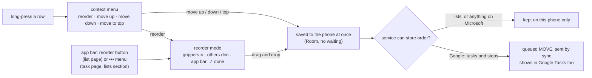

# Feature Specification: Reordering tasks, lists and steps

**Feature Branch**: `003-reordering`

**Created**: 2026-10-06

**Status**: Draft

**Input**: User description: "create a new spec to allow for re-ordering tasks, lists, and steps.
Use the Metro UI guidelines"

## At a glance

Today the app shows tasks in the service's order (Google) or newest-edited first (Microsoft),
lists by name, and steps in the order they were added. Nothing can be moved by hand. This feature
adds a Metro **reorder mode** to the three places order matters (a list's tasks, a task's steps,
and the lists themselves), plus "move up / move down / move to top" in the long-press menu for
quick single moves and for TalkBack users.

What each service lets other apps do with order (details and sources in
[research.md](research.md)):

| | Google Tasks | Microsoft To Do |
|---|---|---|
| Read the order of tasks | ✔ `position` | ✘ no order field |
| Change the order of tasks | ✔ `tasks.move` with `previous` | ✘ no endpoint |
| Read / change the order of steps | ✔ steps are subtasks, same `position` and `move` | ✘ `checklistItem` has no order field or move |
| Read / change the order of lists | ✘ `tasklists` has no order field or move | ✘ `todoTaskList` has no order field |

So: **Google task and step order syncs both ways. Everything else is kept on this phone.** The app
says so once, plainly, the first time it matters (FR-231), and never pretends otherwise.

## Metro guidelines this follows

Windows Phone 8.1 had one reordering pattern, used by the Start screen ("rearrange") and by list
views with reorder mode turned on. This spec copies it rather than inventing an Android one.

| WP8.1 pattern | How it appears here |
|---|---|
| Reorder is a **mode** you enter on purpose, from an app bar button or a context menu. Press-and-hold outside the mode opens the context menu, so it can't also start a drag. | "reorder" app bar button on a list page, "reorder steps" and "reorder lists" in the ••• menus, and "reorder" at the top of every task, step and list context menu. |
| In the mode, the item you hold **pops forward** (a little larger) and everything else **recedes** (dimmed). Neighbors **slide** to open a gap where it will land. | Held row scales to 105% at full opacity with a 4dp flat accent bar on its left edge; other rows drop to 45% opacity; neighbors slide (150 ms, Metro ease-out) to open a dashed accent slot. No shadow and no elevation: Principle I. |
| The app bar collapses to a single **accept (✓) "done"** button; the hardware/gesture **back** also leaves the mode. | Same. Leaving by "done" or back keeps the new order. There is no cancel: every drop is already saved, like the Start screen. |
| Content stays text-first; controls that don't apply in the mode go away. | Checkboxes are shown but not tappable, the "add a task" box and two-line details previews hide so more rows fit, and each row gets a three-bar gripper (≡) on its right edge. |
| Lowercase labels, 48dp targets, 12dp gutter. | "reorder", "move up", "move down", "move to top", "move to bottom". The gripper's touch target is the full row height and at least 48dp wide. |

The gripper is the one addition WP8.1 didn't have: Android users look for it, and it gives the
drag a visible handle for people who don't know the mode exists. A drag can start anywhere on a
row in reorder mode, not only on the gripper.

## User Scenarios & Testing *(mandatory)*

### User Story 1 - Put tasks in my own order (Priority: P1)

Dustin opens his "errands" list. He taps the **reorder** button in the app bar. The "add a task"
box slides away, rows go compact (title and one caption line), and a gripper appears on each row.
The app bar becomes a single ✓ "done". He presses "Return library books", it pops forward, the
other rows dim, and as he drags it down the rows below slide up to make room. He drops it third.
He taps done. In Google mode the same order shows in Google Tasks on his laptop a moment later.

**Why this priority**: Task order is the most common need, and Google already supports it, so this
syncs for real.

**Independent Test**: With the fake provider in Google mode and 6 tasks in a list, enter reorder
mode, drag the first task to third, tap done. The list shows the new order at once, one `MOVE` is
queued, and after a sync the fake's `tasks.move` was called with `previous` = the new second task.

**Acceptance Scenarios**:

1. **Given** a list sorted by "my order", **When** Dustin taps reorder, **Then** the page enters
   reorder mode within 100 ms (Principle II) and looks like `mockups/reordering-mockups.png`
   column 2.
2. **Given** the list is sorted by due date or title, **When** he taps reorder, **Then** the sort
   switches to "my order" (the sort label under the title updates) before the mode opens, because
   a manual order only means something in "my order".
3. **Given** reorder mode, **When** he drops a task, **Then** the new order is saved to the phone
   in the same frame the drop animation ends, before any network call.
4. **Given** Google mode and a dropped task, **When** sync runs, **Then** the task is at the same
   place in Google Tasks.
5. **Given** a task with steps, **When** it is moved, **Then** its steps move with it (Google
   moves subtasks with their parent).
6. **Given** reorder mode, **When** he presses back, **Then** the mode ends and the order he set is
   kept.
7. **Given** the list is longer than the screen, **When** he drags a task near the top or bottom
   edge, **Then** the list scrolls smoothly in that direction, faster the closer he gets.

---

### User Story 2 - Quick moves from the long-press menu (Priority: P1)

Dustin long-presses "Get stamps". The Metro context menu now starts with **reorder** (enters the
mode with that row already picked up), then **move up**, **move down**, **move to top**, and the
existing **move to list...** and **delete**. He taps move to top and the row slides to the top.

**Why this priority**: Moving one task to the top is the most common reorder and should take two
taps. These entries are also how TalkBack and switch-access users reorder, since dragging isn't
practical for them.

**Independent Test**: Long-press the third of 5 tasks, tap "move to top"; it becomes first, one
`MOVE` is queued. With TalkBack on, the same row exposes "move up", "move down", "move to top"
and "move to bottom" as custom accessibility actions.

**Acceptance Scenarios**:

1. **Given** the first task, **When** its menu opens, **Then** "move up" and "move to top" are
   hidden (not greyed). Same for "move down" on the last.
2. **Given** a list not in "my order", **When** a move entry is tapped, **Then** the sort switches
   to "my order" first, so the move is visible.
3. **Given** TalkBack, **When** a move action runs, **Then** TalkBack announces the new place
   ("Get stamps, moved to position 1 of 5").

---

### User Story 3 - Reorder steps inside a task (Priority: P2)

On the "Call the vet" task page, Dustin opens ••• and taps **reorder steps** (or long-presses a
step and taps reorder). The steps get grippers, the rest of the page dims, and he drags "Ask about
the booster" up to second.

**Why this priority**: Steps are short checklists where order often is the plan. Lower than tasks
because few tasks have many steps.

**Independent Test**: With 4 steps, drag the third to second; the step order on the phone updates
at once. In Google mode a `move` with `parent` = the task and `previous` = the first step is sent.
In Microsoft mode nothing is sent and the order survives a sync.

**Acceptance Scenarios**:

1. **Given** steps in reorder mode, **When** one is dropped, **Then** it is saved to the phone at
   once and the task's step preview on the list page (if shown) follows.
2. **Given** Google mode, **When** sync runs, **Then** Google Tasks shows the subtasks in the new
   order.
3. **Given** Microsoft mode, **When** sync runs, **Then** the phone keeps the order Dustin set
   (see FR-223), and To Do keeps its own.
4. **Given** a new step is added with "add a step", **When** it saves, **Then** it goes to the
   bottom, as today.

---

### User Story 4 - Put my lists in my own order (Priority: P2)

On the home panorama's **lists** section, Dustin opens ••• and taps **reorder lists** (or
long-presses a list tile and taps reorder). Because the panorama scrolls sideways, this opens a
plain **lists** page with "drag a list to move it" under the title, the same tiles with grippers,
and a ✓ done button. He drags "Work" up under "Inbox". Back on the panorama, the lists section and
every "move to list" picker use the new order.

**Why this priority**: Useful but less frequent than task order, and it can't sync on either
service, so it is phone-only.

**Independent Test**: With 5 lists, drag the third to second, tap done. The lists section, the
move-to picker and the search scope list all use the new order. Sign out and back in to the same
account: the order is still there (it is stored like list shades).

**Acceptance Scenarios**:

1. **Given** the reorder lists page, **When** a list is dropped, **Then** the order is saved on the
   phone at once; nothing is sent to the service.
2. **Given** the default list (Google "My Tasks", To Do "Tasks"), **When** reordering, **Then** it
   can be moved like any other list. Until it is moved it stays first, as today.
3. **Given** a list created on another device, **When** it arrives by sync, **Then** it is added at
   the bottom of the lists section and doesn't disturb the order Dustin set.
4. **Given** a list deleted remotely, **When** sync removes it, **Then** the remaining lists keep
   their relative order.
5. **Given** a reinstall or a new phone with Android backup, **When** he signs in to the same
   account, **Then** his list order comes back with his list shades.

---

### User Story 5 - Know what syncs (Priority: P2)

In Microsoft mode, the first time Dustin enters any reorder mode, a Metro message dialog says
**order stays on this phone**: "Microsoft To Do doesn't let other apps read or change the order of
tasks, lists or steps. The order you set here is kept on this phone and doesn't show in To Do."
with one **got it** button. In either mode, the reorder
lists page shows "this order is kept on this phone" under the last list.

**Why this priority**: Without it, a Microsoft user would reorder, open To Do on the web, and think
sync is broken.

**Independent Test**: Microsoft mode, fresh install: enter reorder mode on any page; the dialog
shows once. Enter it again, or on another page: no dialog. Google mode: no dialog on the task or
step pages.

**Acceptance Scenarios**:

1. **Given** Microsoft mode and the dialog never shown, **When** reorder mode opens, **Then** the
   dialog shows over it; the mode is usable as soon as it's dismissed.
2. **Given** the dialog was shown once, **When** reorder mode opens again, **Then** no dialog.
3. **Given** Google mode, **When** the reorder lists page opens, **Then** its footer line says the
   list order is kept on this phone (Google can't store it either).

---

### Edge Cases

- **Sync arrives during reorder mode**: changes to that list (or task, or the lists) are held
  until the mode ends, then applied, so nothing jumps under the finger (Principle II). New rows
  that arrive while held appear after done, faded in.
- **The same Google list is reordered on another device while a local move is still queued**: the
  queued local move is newer and still pending, so it wins (Principle IV) and is pushed; a
  `CONFLICT` entry is written to the sync log naming the task and both places.
- **The task moved was deleted or completed elsewhere** before the push: the move is dropped
  quietly (`NotFound` on a move is not an error to show).
- **Completed tasks**: they are not shown in reorder mode and keep their own place in Google's
  order. Dropping a task between two open tasks sends `previous` = the open task above it, so
  hidden completed tasks never decide where it lands.
- **Moving a task to another list** ("move to list..."): it lands at the top of the target list,
  as today, in both modes.
- **Adding a task**: new tasks go to the top of the list in both modes (Google inserts at the top
  without `previous`; the Microsoft local order key is set to before the current first task).
- **Offline**: everything works; Google moves wait in the outbox. Many moves of the same task while
  offline coalesce into one `MOVE` (spec 001 outbox rules) that sends its final place.
- **Today and done sections, and search**: no reorder. Today is ordered by due date across lists,
  done by completion time, search by relevance; a manual order has no meaning there. Their menus
  don't show reorder entries.
- **Very long lists** (over 500 tasks): reorder mode still holds 60 fps; only visible rows are
  composed and the drop writes only the moved row's order key (FR-241).
- **Switching services**: task and step order stored on the phone is cleared with the tasks
  (spec 001 rule). List order is kept per account and comes back if the same account is
  connected again (like list shades).
- **Remove animations is on**: the held row doesn't scale, neighbors jump instead of sliding, the
  slot is still drawn; dragging still works.

## Requirements *(mandatory)*

### Functional Requirements

**Reorder mode (all three places)**

- **FR-201**: The app MUST offer a reorder mode on the list page (tasks), the task page (steps)
  and a reorder lists page (lists), entered from the app bar or ••• menu and from the long-press
  context menu's first entry "reorder".
- **FR-202**: In reorder mode, rows MUST show a three-bar gripper on the right, the held row MUST
  scale to 105% with a 4dp flat accent bar on its left, and other rows MUST dim to 45% opacity.
  Neighbors MUST slide to open a dashed accent slot at the drop position. No shadow, elevation,
  gradient or Material ripple (Principle I).
- **FR-203**: In reorder mode the app bar MUST show only a ✓ "done" button; back MUST also end the
  mode. Both keep the order.
- **FR-204**: In reorder mode, list pages MUST hide the "add a task" box and details previews, and
  checkboxes MUST NOT respond to taps.
- **FR-205**: A drag MUST start on touch-down on the gripper, or after a press of 150 ms anywhere
  else on the row (so the page can still scroll with a quick swipe). Pickup MUST give a light
  haptic tick.
- **FR-206**: Dragging near the top or bottom 64dp of the list MUST auto-scroll, speeding up
  toward the edge.
- **FR-207**: Reordering tasks MUST switch the list's sort to "my order" when it isn't already.

**Context menu and accessibility**

- **FR-210**: The task, step and list context menus MUST add "reorder", "move up", "move down"
  and "move to top" (lists also "move to bottom"), hiding entries that don't apply at an end.
- **FR-211**: Every reorderable row MUST expose "move up", "move down", "move to top" and "move to
  bottom" as accessibility custom actions, and announce the new position after a move.

**Saving and syncing**

- **FR-220**: Every move MUST be saved to the local database immediately and shown from it; no
  move waits for the network (Principle II, IV).
- **FR-221**: In Google mode, a task move MUST queue a `MOVE` that sync sends as `tasks.move` with
  `previous` = the remote id of the nearest open task above it (none for the top).
- **FR-222**: In Google mode, a step move MUST queue a step `MOVE` that sync sends as `tasks.move`
  with `parent` = the task's remote id and `previous` = the step above it (none for first).
- **FR-223**: In Microsoft mode, task and step order MUST be kept on the phone only and never sent.
  Pulls MUST NOT overwrite it; tasks and steps new to the phone get a place (tasks at the top,
  steps at the bottom) without moving the others.
- **FR-224**: Microsoft's first sync on a phone MUST seed task order newest-created first and step
  order in the order Graph returns them.
- **FR-225**: List order MUST be kept on the phone only, for both services, in the same per-account
  store as list shades (keyed by service and remote list id), so it survives sign-out, reinstall
  with backup, and switching services and back.
- **FR-226**: In Google mode, when a pull changes a task's or step's `position` and no local move
  for it is pending, the phone MUST take Google's order (another device reordered it).
- **FR-227**: A local move that is still pending when a pull brings a different position MUST win
  and be logged as a `CONFLICT` in the sync log (Principle IV).
- **FR-228**: While a reorder mode is open, sync MUST hold changes to that list, task or the lists
  until the mode ends, with no time limit shorter than the mode (today's 5-second hold cap does
  not apply to reorder mode).

**Honesty about what syncs**

- **FR-230**: The reorder lists page MUST say "this order is kept on this phone".
- **FR-231**: In Microsoft mode, the first reorder mode ever opened on the phone MUST show the
  "order stays on this phone" dialog once, with a single "got it" button. It MUST NOT show in Google mode
  for tasks or steps.
- **FR-232**: The sync account page (settings) MUST list, for the connected service, what order
  syncs: Google "task and step order sync; list order stays on this phone", Microsoft "task, step
  and list order stay on this phone".

**Performance (Principle II)**

- **FR-240**: Entering and leaving reorder mode MUST give visible feedback within 100 ms and hold
  60 fps (90/120 on high-refresh phones) during drag, slide and auto-scroll.
- **FR-241**: A drop MUST write only the moved row's order key, using keys that can always be
  placed between two neighbors without renumbering the rest. Renumbering, if ever needed, MUST run
  off the main thread.
- **FR-242**: A new macrobenchmark MUST drag a task across a 200-task list and fail CI if frames
  are dropped beyond the scroll budget from spec 001.

### Key Entities

- **Task order key**: a sortable string per task. Google mode: Google's `position`, or a local key
  between neighbors until the move is pushed and the real position comes back. Microsoft mode: a
  local key only. Reuses `TASK.position` (spec 001 data model already says "Google position or
  local order key").
- **Step order**: `STEP.sortOrder`, changed from a dense integer to the same kind of sortable key
  so a move writes one row.
- **List order**: per-account map in the phone-only preferences store, next to list shades.
- **Step `MOVE` operation**: new outbox entry kind for steps (tasks already have `MOVE`).
- **"Order note shown" flag**: a phone-only preference for FR-231.

See [data-model.md](data-model.md).

## Success Criteria *(mandatory)*

### Measurable Outcomes

- **SC-201**: Moving a task to the top takes 2 taps (long-press, move to top) from the list page.
- **SC-202**: In Google mode, a task or step moved on the phone appears in the same place in
  Google Tasks within one sync, in 100% of scripted runs against the fake Google server, including
  runs that go offline and back.
- **SC-203**: In both modes, an order set on the phone is unchanged after 20 consecutive syncs with
  no remote reorder (no drift).
- **SC-204**: The drag benchmark (FR-242) holds the scroll budget from spec 001 on the CI
  emulator.
- **SC-205**: Every reorder action can be completed with TalkBack alone.

## Assumptions

- "Steps" means the checklist inside a task (Google subtasks, To Do checklist items), as in spec
  001. Google allows one level of subtasks, so steps can't be dragged out to become tasks, or tasks
  dragged into another task as steps. Out of scope for this feature.
- Dragging a task onto another list (across pages) is out of scope; "move to list..." already does
  that.
- Reordering the home panorama sections (today, lists, done) is out of scope.
- Microsoft step order is phone-only by default. Research R5 describes a possible way to push it
  (delete and re-create checklist items in order), rejected for now because it changes the steps'
  ids and could lose a tick made on another device at the same moment. Dustin may choose it later.
- The one-time Microsoft note is per phone, not per account.
