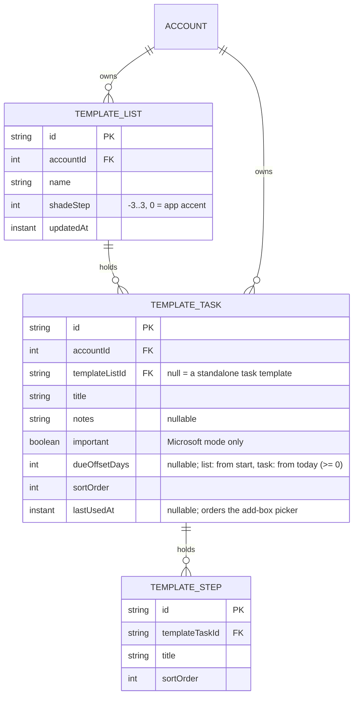

# Data model: List and task templates

Three new Room tables in the next database version (v3, AutoMigration from v2). They have no
`remoteId`, are never in the outbox or sync log. `template_list` and `template_task` carry an `accountId`
foreign key to `account` with `ON DELETE CASCADE`, so `AccountRepository.disconnect` (which deletes
the account row) removes them with the lists and tasks (FR-303).

Rules:

- Deleting a list template cascades to its tasks and steps.
- Using a template copies rows into `task_list`, `task` and `step` in one transaction and enqueues
  `CREATE` operations, exactly like hand-made items (FR-323). The new list's shade is written to
  `ListShadeStore` under its local id and adopted to the remote id after sync, as today.
- Task order in a list template uses `sortOrder` integers; renumbering at most 200 rows is fine.
