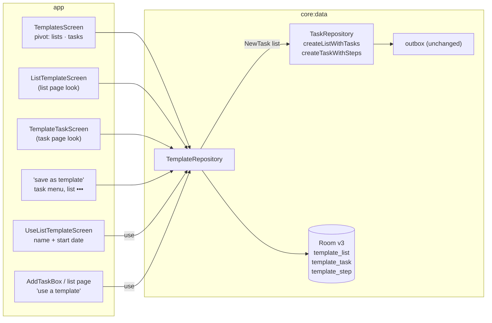

# Implementation Plan: List and task templates

**Branch**: `004-templates` (git: `claude/templates-spec-4qdtzj`) | **Date**: 2026-10-06 | **Spec**: [spec.md](spec.md)

## Summary

Three new Room tables hold templates on the phone. A `TemplateRepository` in `core:data` edits
them and, when one is used, turns it into ordinary `NewTask`s that `TaskRepository` saves and
queues in one transaction, exactly like hand-made items. Nothing in `core:sync` or the providers
changes: created lists and tasks go through the existing outbox.

## Technical decisions

| Decision | Choice | Why |
|---|---|---|
| Storage | Room tables with an `accountId` foreign key (cascade), Room v3 by AutoMigration. | Sign-out and switch already delete the account row, so templates go with it (Dustin: no survive on switch). |
| One table for both task kinds | `template_task.templateListId` null means a standalone task template. | Same fields, one editor, one DAO. |
| Using a list template | `TaskRepository.createListWithTasks` writes the list, every task and step and their `CREATE`s in one transaction. Tasks are queued last first. | Google inserts each created task at the top, so the first task must be sent last to end up first there; Microsoft order is phone-only and uses order keys. |
| Using a task template | `createTaskWithSteps` with the id the screen already shows (spec 001 instant add). | The row appears before the write, like a typed task. |
| Saving a list | Open tasks in "my order", then completed ones, all unticked; offsets from the earliest due date. | Spec 004 US3. |
| Feedback after "save as template" | Opens the new template's editor instead of a toast. | The app has no toast component (Metro has none), and the next thing people do is adjust offsets or the name. |
| Where "templates" lives | Home ••• menu (every section). Settings has no entry. | One way in is enough (Principle VI); the ••• menu is where "reorder lists", "settings" and "sync log" already are. |
| Due picker | A Metro picker of offsets: none, the start day, up to 31 days either side (list) or 0 to 62 days (task). | Reuses `MetroPickerDialog`; the repository accepts up to a year. |

## Constitution Check

| Principle | Status |
|---|---|
| I. Metro | Pass: pivot, context menu and ••• entries, editors that look like the list and task pages, light and dark screenshots. |
| II. Fast and Fluid | Pass: one transaction per use; task templates show before the write; flows mapped off the main thread. |
| III. One provider | Pass: templates are cleared on switch; the important toggle follows `ServiceFeatures.importance`. |
| IV. Offline first | Pass: everything is local; creates go through the outbox. |
| V. Test the seams | Pass: repository tests for save, use (both order modes), offsets, reorder and sign-out; screenshot and add-from-picker tests. |
| VI. Small and simple | Pass: no provider or sync changes, no new module. |
