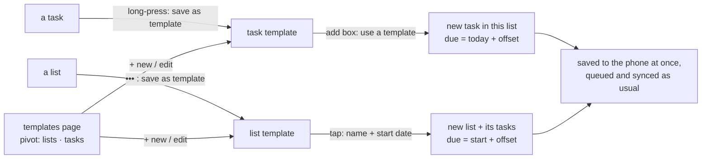

# Feature Specification: List and task templates

**Feature Branch**: `004-templates`

**Created**: 2026-10-06

**Status**: Approved (Dustin, 2026-10-06); implemented

**Input**: User description: "help me plan the concept of a list template and a task template"

## At a glance

A **template** is a recipe kept on this phone. Using one makes ordinary lists and tasks, which
appear at once and sync to Google Tasks or Microsoft To Do like anything typed by hand. Neither
service has templates (see [research.md](research.md)), so the template itself never leaves the
phone.

- A **task template** holds a title, details, steps, the important flag (Microsoft only) and an
  optional due offset ("due in 3 days").
- A **list template** holds a list name, a shade, and its tasks, each shaped like a task template,
  with due offsets counted from a **start date** ("3 days before start").

Decisions Dustin made on 2026-10-06:

| Question | Answer |
|---|---|
| Due dates in templates are offsets from a start date | yes |
| A list template can add its tasks into an existing list | no, it always makes a new list |
| Templates survive switching between Google and Microsoft | no, they are cleared with the tasks |
| The app ships starter templates | no |
| Where templates are stored | on the phone only |

## Metro guidelines this follows

| WP8.1 pattern | How it appears here |
|---|---|
| Secondary commands live in the long-press context menu and the app bar's ••• menu, in lowercase. | "save as template" in the task context menu and the list page's ••• menu; "templates" in the home ••• menu. |
| Collections of a few kinds are a **pivot**. | The templates page is a pivot with "lists" and "tasks". |
| An editor looks like the thing it edits. | A list template opens on a page laid out like a list page, with the small header "LIST TEMPLATE" and dimmed checkboxes; a task template opens like the task page. |
| A full-page form with text fields and a pair of buttons. | "new list from template": name, start date, create and cancel. |
| Text first, accent for links. | "use a template" is an accent text link under the "add a task" box, like "add details" (spec 001). |

## User Scenarios & Testing *(mandatory)*

### User Story 1 - Use a list template (Priority: P1)

Dustin packs for trips with the same 14 things. He taps "trip packing" on the templates page,
names the new list "Denver trip", picks Friday Oct 17 as the start date and taps create. The list
and its tasks appear at once, with "book parking" due Oct 14 and "water the plants" due Oct 17,
and show up in Google Tasks or To Do after the next sync.

**Acceptance Scenarios**:

1. **Given** a list template with 14 tasks, 4 with due offsets, **When** the user creates a list
   from it with start date Oct 17, **Then** a new list appears with 14 open tasks in the
   template's order, each due date equal to Oct 17 plus its offset, steps and details copied.
2. **Given** a list template with no due offsets, **When** the user uses it, **Then** the form asks
   only for the name.
3. **Given** the phone is offline, **When** the user creates a list from a template, **Then** the
   list and tasks appear at once and are sent when the phone is back online.
4. **Given** a list made from a template, **When** the user edits it, **Then** the template is
   unchanged, and editing the template later doesn't change the list.

### User Story 2 - Use a task template (Priority: P1)

Every month Dustin adds "pay rent". He taps the "add a task" box, taps "use a template", then
"pay rent". It is added to that list at once, due in 3 days and marked important.

**Acceptance Scenarios**:

1. **Given** the add box on today or a list page, **When** the user taps "use a template",
   **Then** the task templates are listed below the box, newest-used first.
2. **When** the user taps a task template, **Then** the task is added like a typed task (same
   list and place, instant, spec 001 FR on optimistic add) with title, details, steps,
   important flag, and due date = today + offset.
3. **Given** there are no task templates, **Then** "use a template" is not shown.

### User Story 3 - Save something as a template (Priority: P2)

**Acceptance Scenarios**:

1. **When** the user long-presses a task and picks "save as template", **Then** a task template is
   made from its title, details and steps (all unticked) and important flag, with no due offset,
   and its editor opens so the user can adjust it.
2. **When** the user picks "save as template" from a list page's ••• menu, **Then** a list template
   is made with the list's name, shade, and every task in it, open and completed, all unticked, in
   the list's current order. Due offsets are counted from the earliest due date in the list, which
   becomes the start date (no due dates means no offsets).
3. Saving never changes the original list or task.

### User Story 4 - Manage templates (Priority: P2)

**Acceptance Scenarios**:

1. **When** the user opens "templates" from the home ••• menu, **Then** a
   pivot shows "lists" and "tasks", each sorted by name.
2. Tapping a list template opens "new list from template"; tapping a task template opens it for
   editing. Long-press offers "edit", "rename" and "delete".
3. In the list template editor the user can add, edit, delete and reorder tasks (spec 003 reorder
   mode), set each task's offset with a "days before / on / after start" picker, and change the
   name and shade. The app bar has "use" and "add".
4. "+ new" on the templates page makes an empty template of the kind on the current pivot.

### Edge Cases

- **Switching services or signing out**: templates are deleted with the local tasks
  (Dustin, 2026-10-06). The sign-out and switch confirmations say "your templates on this phone
  will be removed".
- **Important flag in Google mode**: not shown in the editor and not saved, since Google Tasks has
  no importance (research R2). Because templates are cleared on a switch, a template never carries
  a flag the service can't store.
- **Shared lists**: saving a shared list or an assigned task copies only its content. The new list
  is private; assignment is not copied (spec 002).
- **Name clash**: a new list may share a name with an existing one; both services allow that.
- **Offset makes a past date**: allowed; the task shows as overdue, like any task.
- **Size**: a list template holds at most 200 tasks and each task at most 100 steps; "save as
  template" on a bigger list saves the first 200 and says so.
- **Sync log**: templates are never in the sync log; the lists and tasks they create are, like any.
- **Search** does not find templates.

## Requirements *(mandatory)*

### Functional Requirements

**What a template holds**

- **FR-301**: A task template MUST hold a title, details, an ordered list of step titles, an
  important flag (Microsoft mode only) and an optional due offset in whole days (0 or more).
- **FR-302**: A list template MUST hold a name, a shade step (spec 001 per-list shades) and an
  ordered list of tasks with the same fields as a task template, whose due offsets may be negative
  (before start), zero or positive.
- **FR-303**: Templates MUST be stored in the phone's database only, never sent to a service, and
  MUST be deleted when the account is disconnected (sign-out or switch).

**Making templates**

- **FR-310**: The task context menu MUST add "save as template".
- **FR-311**: The list page's ••• menu MUST add "save as template".
- **FR-312**: The templates page MUST offer "+ new" for the current pivot's kind.
- **FR-313**: Saving MUST follow User Story 3 and open the new template's editor.

**Using templates**

- **FR-320**: Using a list template MUST always create a new list (no "add to an existing list").
- **FR-321**: The "new list from template" page MUST ask for a name (prefilled with the template's
  name) and, only when a task has a due offset, a start date (default today).
- **FR-322**: Due date of each created task MUST be start date + offset (list) or today + offset
  (task). Steps MUST be created unticked in template order.
- **FR-323**: Created lists, tasks and steps MUST be written to the database and shown at once,
  then queued in the outbox like hand-made ones (Principle II and IV). The new list gets the
  template's shade.
- **FR-324**: The add box on today and on list pages MUST show an accent "use a template" link while
  it is empty and at least one task template exists. Picking one adds the task where a typed task
  would go.

**Managing templates**

- **FR-330**: A "templates" page MUST be reachable from the home ••• menu, as a pivot with "lists"
  and "tasks".
- **FR-331**: Template editors MUST reuse the list page and task page layouts, with a "LIST
  TEMPLATE" / "TASK TEMPLATE" header, dimmed non-tappable checkboxes, and offsets in place of
  dates.
- **FR-332**: Template tasks and steps MUST support spec 003 reorder mode.
- **FR-333**: The sign-out and switch confirmations MUST mention that templates will be removed.

**Performance (Principle II)**

- **FR-340**: Creating a list from a 200-task template MUST show the new list within 300 ms on the
  CI emulator, writing in one database transaction off the main thread.
- **FR-341**: Opening the templates page and the "use a template" picker MUST give visible
  feedback within 100 ms and hold 60 fps while scrolling.

### Key Entities

- **List template**: name, shade step, ordered tasks.
- **Template task**: belongs to a list template, or stands alone as a task template; title,
  details, important, due offset, order.
- **Template step**: belongs to a template task; title, order.

See [data-model.md](data-model.md).

## Success Criteria *(mandatory)*

- **SC-301**: From the home panorama, a list is created from a template in 4 taps plus typing a
  name (••• → templates → tap template → create).
- **SC-302**: A task template is added in 2 taps from the add box.
- **SC-303**: Lists and tasks created from templates reach the fake Google and Microsoft servers
  with the expected titles, details, steps and due dates in 100% of scripted runs, including
  offline and back.
- **SC-304**: After a switch or sign-out, no template rows remain in the database.
- **SC-305**: Every template action can be completed with TalkBack alone.

## Assumptions

- No placeholders in text (like "{date}") in v1.
- Recurring tasks are out of scope; a task template is used by hand.
- No import, export or sharing of templates; they are lost on reinstall (Dustin chose phone-only).
- Task templates and the tasks inside list templates are separate copies; editing one doesn't
  change the other.
- Due dates remain date-only (spec 001).
