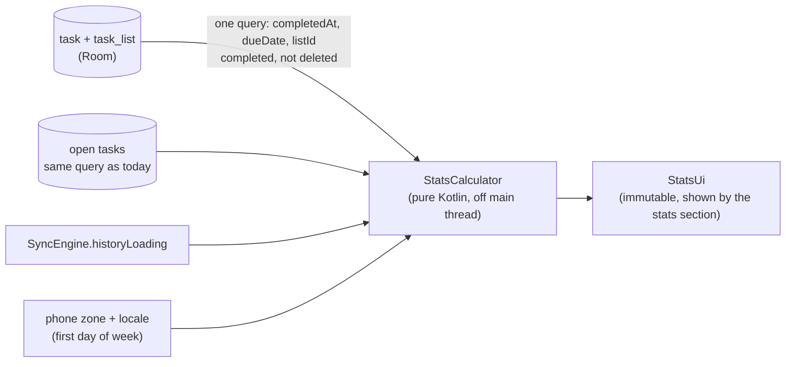

# Data model: Stats

No new tables and no database migration. Stats are derived from existing rows.



New query (TaskDao):

```sql
SELECT t.completedAt, t.dueDate, t.listId FROM task t
JOIN task_list l ON l.localId = t.listId
WHERE t.completed = 1 AND t.deletedLocally = 0 AND l.deletedLocally = 0
  AND t.completedAt IS NOT NULL
```

Counts for "right now" reuse the open-task counts the today and lists sections already observe.

`StatsUi` (derived, never stored):

| Field | Meaning |
|---|---|
| `thisWeek: List<Int>` (7) | done per day, locale week order |
| `lastWeekTotal: Int` | |
| `streak`, `bestStreak: Int` | FR-412 |
| `onTimePercent: Int?` | null under 5 dated tasks (FR-413) |
| `weeks: List<IntArray>` (12 × 7) | done per day; `oldestLoaded: LocalDate` marks striped days |
| `levels: IntArray` | quintile thresholds for the 5 shades (FR-414) |
| `byList: List<Pair<listId, Int>>` | top 5, last 30 days |
| `allTime`, `since: YearMonth`, `perWeek`, `busiestWeekday`, `bestWeek` | |
| `partial: Boolean` | history still loading (FR-420) |

`StatsCalculator` is a pure function of (rows, today, zone, locale, partial), so every number is
unit-tested against fixed inputs (SC-402).
