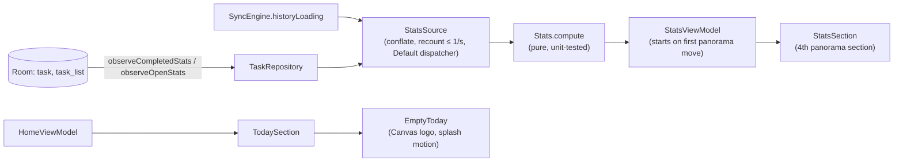

# Plan: Stats and the empty today

Spec: [spec.md](spec.md). Approved by Dustin on 2026-10-06 ("do it").

| Area | Change |
|---|---|
| core:data | `CompletedStat`, `OpenStat` projections and two `TaskDao` queries; no schema change, no migration. |
| core:sync | `SyncEngine.historyLoading`, true while lists wait for their history load. |
| app `ui/stats` | `Stats` (pure counting, FR-410 to FR-416), `StatsSource`, `StatsViewModel`. |
| app `ui/home` | `StatsSection` (FR-401 to FR-421), `EmptyToday` (FR-440 to FR-443); `HomeContent` gets a fourth section and starts stats on the first panorama move. |
| benchmark | `PanoramaBenchmark` swipes four sections each way (FR-432). |

Decisions made while building:

- Stats start counting the first time the panorama moves away from "today" or is swiped, not at
  launch (FR-431). Until then the section shows placeholders.
- The 12-week shades scale to the busiest day in the grid rather than quintiles; it reads the same
  and stays stable for sparse histories.
- "A typical week" averages the whole weeks in the grid since the oldest completed task, so a new
  account isn't compared with empty weeks.
- The empty-today logo is drawn on a Canvas from the launcher icon's paths, replaying the splash
  timeline (head rises 30 units over 600 ms, four fading trail frames, the short stroke ticks in
  from 320 ms); at rest it is one path so the corner is a clean miter.
