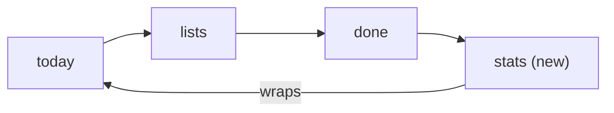

# Feature Specification: Stats

**Feature Branch**: `005-stats`

**Created**: 2026-10-06

**Status**: Draft, waiting for Dustin's OK

**Input**: User description: "create a spec to show a stats view after the done view"

## At a glance

A fourth home panorama section, **stats**, comes after "done". It counts what you finished, using
tasks already on the phone. Nothing new is fetched from or sent to Google Tasks or Microsoft To Do:
both give each completed task a completed date, and that is all stats needs (see
[research.md](research.md)).

What it shows, top to bottom:

| Block | Shows | Counted from |
|---|---|---|
| this week | big count, last week's count, one bar per day | completed date |
| streak | days in a row with at least one task done, and the best ever | completed date |
| on time | share of tasks with a due date done on or before it, last 30 days | completed date + due date |
| last 12 weeks | one flat square per day in 5 shades of the accent; tap a square to read its day | completed date |
| right now | open, overdue (in the red "today" uses), no due date | open tasks |
| by list | done per list over the last 30 days, bars in each list's shade; tap opens the list | completed date + list |
| all time | total done since the oldest completed task, a typical week, busiest weekday, best week | completed date |

## Metro guidelines this follows

| WP8.1 pattern | How it appears here |
|---|---|
| A panorama is one long canvas of sections; hubs like People and Music added sections for more of the same story. | stats is one more section with a lowercase header, after "done", before the wrap back to "today". |
| Typography is the interface. | Numbers are set big and light in the accent (the 64sp "header" size), labels in the body size, context in gray. |
| Flat color, no gradients, no chart chrome. | Bars and squares are flat fills of the accent and its shades (the same 7-step scale lists use); no axes, grid lines, legends beyond "less / more", or shadows. |
| Content-shaped placeholders, never spinners. | Weeks not loaded yet are striped squares; numbers that may grow get a "+" and a gray line. |
| Same application bar on every section. | search and ••• as on "done". |

## User Scenarios & Testing *(mandatory)*

### User Story 1 - See how my week is going (Priority: P1)

Dustin swipes past "done" and sees 23 done this week against 18 last week, a 5-day streak and 86%
on time.

**Acceptance Scenarios**:

1. **Given** tasks completed on Sun, Mon, Tue, Wed and Thu this week, **When** the user opens stats on
   Thursday, **Then** the count is the sum, each day has a bar with its count, Thursday's bar is in
   the accent, Friday and Saturday show as empty.
2. **Given** at least one task done on each of the last 5 days including today, **Then** the streak
   reads 5. **Given** none done yet today but 5 days in a row up to yesterday, **Then** the streak
   still reads 5 (today ends the streak only once it is over).
3. **Given** 50 tasks done in the last 30 days, 28 of them with a due date and 24 of those done on
   or before it, **Then** on time reads 86%. With fewer than 5 dated tasks, on time reads "–" with
   "not enough dated tasks yet".
4. **When** the user ticks or unticks a task anywhere, **Then** stats reflect it the next time the
   section is shown, without a sync.

### User Story 2 - Look back (Priority: P2)

**Acceptance Scenarios**:

1. **When** the user scrolls the section, **Then** "last 12 weeks" shows 84 squares (columns are
   weeks, rows are weekdays), shaded by how many tasks were done that day relative to the user's
   own busiest day in the 12 weeks.
2. **When** the user taps a square, **Then** it gets an outline and the line under the grid reads
   e.g. "Tue Sep 30 · 6 done". Tapping it again clears it.
3. **When** the user taps a row in "by list", **Then** that list's page opens (turnstile, like a
   list tile).
4. "all time" shows the total done, the month of the oldest completed task, done per week on
   average, the busiest weekday and the best week.

### User Story 3 - Right after signing in (Priority: P1)

**Acceptance Scenarios**:

1. **Given** a first sync has brought open tasks but completed history is still loading in the
   background, **When** the user opens stats, **Then** whatever is already on the phone is shown,
   weeks with no data yet are striped placeholders, the streak and all-time numbers carry a "+",
   and a gray line reads "Older tasks are still coming in from <service>. These numbers may grow."
2. **When** the history load finishes, **Then** the placeholders fade into real squares and the
   "+" and the gray line go away, without moving what the user is looking at.
3. **Given** an account with no completed tasks, **Then** the section shows "0 done this week",
   empty bars and "Tick off a task and this page starts filling in." and nothing else.

### Edge Cases

- **Deleted tasks** no longer count: neither service keeps them, so stats can only count what still
  exists. Google's "clear completed" hides tasks, which the app still fetches (`showHidden=true`),
  so they still count.
- **Unticked tasks** stop counting; ticking again counts on the new completed date.
- **Shared lists** (Microsoft): tasks other people tick in a list shared with you count too, since
  To Do doesn't say who completed a task.
- **Switching services or signing out** clears the tasks and so the stats; nothing is kept.
- **Time zones**: a day is the phone's current local day. Microsoft completed dates are read as
  calendar dates (research R2), so they never shift a day.
- **Week start** follows the phone's locale (Sunday in the US, Monday in most of Europe).
- **Very large history** (10,000+ completed tasks) must stay within FR-430.
- **Accessibility**: each block reads as one sentence to TalkBack, e.g. "23 done this week, 18 last
  week"; the 12-week grid reads per week ("week of Sep 28, 19 done") with each day as an action.

## Requirements *(mandatory)*

### Functional Requirements

**Placement**

- **FR-401**: The home panorama MUST have a fourth section titled "stats" after "done". The ring
  becomes today → lists → done → stats → today.
- **FR-402**: The stats section MUST use the same application bar as "done" (search, •••).
- **FR-403**: Opening the app MUST still land on "today"; the app never remembers stats as the
  start section.

**What it counts**

- **FR-410**: A task counts as done on the local calendar day of its completed date. Only tasks
  that are completed, not deleted, and in a list that is not deleted count.
- **FR-411**: "this week" MUST use the locale's first day of week; "last week" is the 7 days before.
- **FR-412**: Streak MUST be the number of consecutive days, ending today or yesterday, with at
  least one task done. Best streak is the longest such run in the data on the phone.
- **FR-413**: On time MUST be the share of tasks done in the last 30 days that had a due date and
  were done on or before it, rounded to a whole percent; shown only when there are at least 5 such
  tasks.
- **FR-414**: The 12-week grid MUST use 6 levels: none, then 5 shades of the app accent from light
  to dark (dark theme: dark to bright) by quintile of the user's own non-zero days.
- **FR-415**: "by list" MUST show up to 5 lists with the most done in the last 30 days, each in its
  list shade (spec 001 per-list shades), and "+ N more lists" if there are more.
- **FR-416**: "right now" MUST count open tasks, overdue open tasks (due before today) and open
  tasks without a due date, with the same rules as the today section.

**Partial history**

- **FR-420**: While any list's completed history is still loading (spec 001 history backfill),
  stats MUST show what is on the phone, mark the streak, best week and all-time numbers with "+",
  stripe the grid weeks older than the oldest completed task loaded so far, and show the gray
  "still coming in" line.
- **FR-421**: When the history load finishes, stats MUST update in place, with placeholders
  fading into content (no jump in layout).

**Performance (Principle II)**

- **FR-430**: Stats MUST be computed off the main thread from one query of completed tasks' dates,
  due dates and list ids, and MUST be ready within 150 ms of the section first coming into view with
  10,000 completed tasks on the CI emulator. Until then the section shows content-shaped
  placeholders.
- **FR-431**: Adding the stats section MUST NOT slow cold start: its numbers are not computed before
  the home screen's first frame, and the startup budget (cold start ≤ 1 s) still holds.
- **FR-432**: The panorama swipe benchmark MUST go round all four sections both ways (it goes round
  three today) and hold the same frame budget.
- **FR-433**: Stats MUST recompute at most once per second while tasks change (for example during
  a sync), and never move content under the user's finger.

### Key Entities

No new stored data. Stats are derived from `task` and `task_list` rows; see
[data-model.md](data-model.md).

## Success Criteria *(mandatory)*

- **SC-401**: From "today", stats is one swipe back (across the wrap) or three forward.
- **SC-402**: For a seeded set of completed tasks, every number on the section matches a reference
  calculation in 100% of unit test runs, including a day-boundary time zone case and a week-start
  case for Sunday and Monday locales.
- **SC-403**: Cold start, panorama swipe and scroll benchmarks stay within budget in CI with the
  fourth section.
- **SC-404**: Every block can be read with TalkBack alone.

## Assumptions

- Stats are for the signed-in account's tasks on this phone; there is no cross-device history.
- No goals, badges, notifications or sharing in v1.
- No time-of-day stats: Microsoft does not give a reliable completion time (research R2).
- No "tasks added" stats: Google Tasks has no created date (research R1).
- Fixed ranges (this week, 30 days, 12 weeks, all time); no range picker in v1, since a pivot
  inside a panorama section would fight the sideways swipe.
